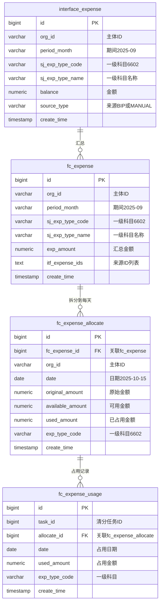
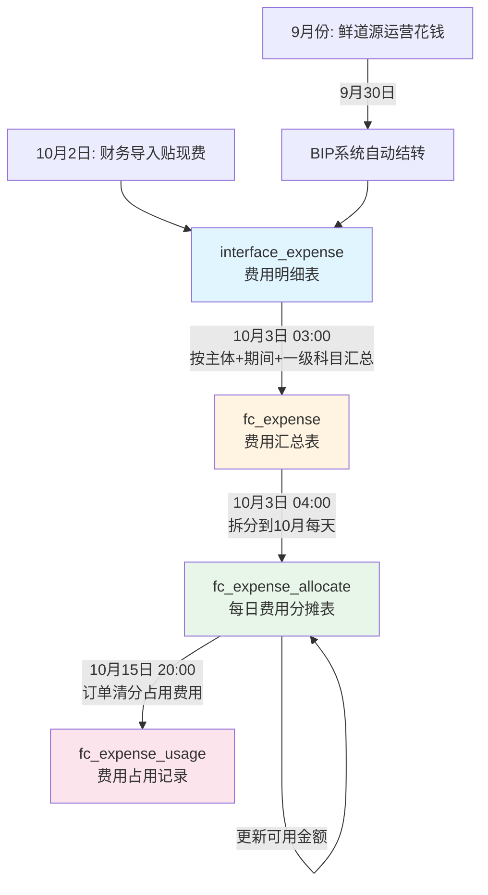

# 清分系统 - 费用分摊详解

## 一、核心概念

### 1.1 清分是什么？

**一句话：自动算账，把中间商的成本加到价格里**

```
邕之泰（老板）：不想自己干活
├─ 采购：找鲜道源、产服、合作社帮忙买猪
└─ 销售：找猪小呆、邕之鲜帮忙卖猪肉

清分系统：自动计算每个小弟该赚多少钱
```

---

### 1.2 费用分摊是什么？

**把上个月的运营成本，分摊到这个月的订单上**

```
鲜道源9月运营成本：62,000元
├─ 房租：20,000
├─ 工资：30,000
├─ 办公费：5,000
└─ 车辆维护：7,000

10月分摊：62,000 / 31天 = 2,000元/天

10月每笔订单：从费用池拿钱加价
```

---

## 二、数据表结构

### 2.1 ER图



---

### 2.2 表1：interface_expense（费用明细表）

**作用：存储所有费用明细（BIP自动 + 手工导入）**

| 字段 | 类型 | 说明 |
|------|------|------|
| id | BIGINT | 主键 |
| org_id | VARCHAR | 主体ID（鲜道源、合作社等） |
| period_month | VARCHAR | 期间（2025-09） |
| sj_exp_type_code | VARCHAR | 一级科目编码（6602） |
| sj_exp_type_name | VARCHAR | 一级科目名称（管理费用） |
| balance | NUMERIC | 金额 |
| source_type | VARCHAR | 来源（BIP/MANUAL） |

**数据示例：**

| ID | 主体 | 期间 | 一级科目 | 金额 | 来源 |
|----|------|------|----------|------|------|
| 1 | 鲜道源 | 2025-09 | 6602 管理费用 | 50000 | BIP |
| 2 | 鲜道源 | 2025-09 | 6602 管理费用 | 12000 | BIP |
| 3 | 鲜道源 | 2025-09 | 6603 财务费用 | 5000 | BIP |
| 4 | 鲜道源 | 2025-09 | 6603 财务费用 | 8000 | MANUAL（贴现） |

---

### 2.3 表2：fc_expense（费用汇总表）

**作用：按主体+期间+一级科目汇总**

| 字段 | 类型 | 说明 |
|------|------|------|
| id | BIGINT | 主键 |
| org_id | VARCHAR | 主体ID |
| period_month | VARCHAR | 期间（2025-09） |
| sj_exp_type_code | VARCHAR | 一级科目编码 |
| exp_amount | NUMERIC | 汇总金额 |
| itf_expense_ids | TEXT | 来源ID列表 |

**数据示例：**

| ID | 主体 | 期间 | 一级科目 | 汇总金额 | 来源ID |
|----|------|------|----------|----------|--------|
| 1 | 鲜道源 | 2025-09 | 6602 | 62000 | 1,2 |
| 2 | 鲜道源 | 2025-09 | 6603 | 13000 | 3,4 |

---

### 2.4 表3：fc_expense_allocate（每日费用分摊表）

**作用：拆分到当月每一天，支持部分占用**

| 字段 | 类型 | 说明 |
|------|------|------|
| id | BIGINT | 主键 |
| fc_expense_id | BIGINT | 关联fc_expense.id |
| org_id | VARCHAR | 主体ID |
| date | DATE | 日期（2025-10-15） |
| original_amount | NUMERIC | 原始金额（每天固定） |
| available_amount | NUMERIC | 可用金额（剩余） |
| used_amount | NUMERIC | 已占用金额 |
| exp_type_code | VARCHAR | 一级科目编码 |

**数据示例：**

| ID | 主体 | 日期 | 一级科目 | 原始金额 | 可用金额 | 已占用 |
|----|------|------|----------|----------|----------|--------|
| 1 | 鲜道源 | 10-01 | 6602 | 2000 | 0 | 2000 |
| 2 | 鲜道源 | 10-02 | 6602 | 2000 | 0 | 2000 |
| 3 | 鲜道源 | 10-03 | 6602 | 2000 | 0 | 2000 |
| 4 | 鲜道源 | 10-04 | 6602 | 2000 | 1500 | 500 |
| 5 | 鲜道源 | 10-05 | 6602 | 2000 | 2000 | 0 |

**关键字段说明：**
- `original_amount`：每天固定金额（不变）
- `available_amount`：剩余可用金额（会减少）
- `used_amount`：已占用金额（会增加）

---

### 2.5 表4：fc_expense_usage（费用占用记录表）

**作用：记录每次清分占用了哪些费用**

| 字段 | 类型 | 说明 |
|------|------|------|
| id | BIGINT | 主键 |
| task_id | BIGINT | 清分任务ID |
| allocate_id | BIGINT | 关联fc_expense_allocate.id |
| date | DATE | 占用日期 |
| used_amount | NUMERIC | 占用金额 |
| exp_type_code | VARCHAR | 一级科目编码 |

**数据示例：**

| ID | 任务ID | 关联ID | 日期 | 占用金额 | 一级科目 |
|----|--------|--------|------|----------|----------|
| 1 | 100 | 1 | 10-01 | 2000 | 6602 |
| 2 | 100 | 2 | 10-02 | 2000 | 6602 |
| 3 | 100 | 3 | 10-03 | 2000 | 6602 |
| 4 | 100 | 4 | 10-04 | 500 | 6602 |

---

## 三、数据流转流程

### 3.1 时间线

```
9月1日-30日：鲜道源日常运营，花钱
10月1日：财务开始算9月的账
10月2日：财务导入贴现费
10月3日 03:00：系统汇总费用（interface_expense → fc_expense）
10月3日 04:00：系统拆分到每天（fc_expense → fc_expense_allocate）
10月15日 20:00：订单清分，占用费用
```

---

### 3.2 流程图



---

## 四、完整示例

### 4.1 前置条件（9月份）

#### 鲜道源9月费用

**GL费用（BIP系统自动）：**
- 工资：30,000
- 房租：20,000
- 办公费：5,000
- 车辆维护：7,000
- 银行利息：3,000
- 小计：65,000

**贴现费（财务手工导入）：**
- 票据贴现手续费：8,000

**总计：73,000**

---

### 4.2 步骤1：10月3日凌晨3点汇总

**从interface_expense汇总到fc_expense：**

| ID | 主体 | 期间 | 一级科目 | 汇总金额 | 说明 |
|----|------|------|----------|----------|------|
| 1 | 鲜道源 | 2025-09 | 6602 管理费用 | 62000 | GL费用 |
| 2 | 鲜道源 | 2025-09 | 6603 财务费用 | 11000 | GL 3000 + 贴现 8000 |

**总计：73,000**

---

### 4.3 步骤2：10月3日凌晨4点拆分

**从fc_expense拆分到fc_expense_allocate：**

```
管理费用：62,000 / 31天 = 2,000元/天
财务费用：11,000 / 31天 = 354.84元/天
```

**fc_expense_allocate表（部分）：**

| ID | 主体 | 日期 | 一级科目 | 原始金额 | 可用金额 | 已占用 |
|----|------|------|----------|----------|----------|--------|
| 1 | 鲜道源 | 10-01 | 6602 | 2000 | 2000 | 0 |
| 2 | 鲜道源 | 10-01 | 6603 | 354.84 | 354.84 | 0 |
| 3 | 鲜道源 | 10-02 | 6602 | 2000 | 2000 | 0 |
| 4 | 鲜道源 | 10-02 | 6603 | 354.84 | 354.84 | 0 |
| ... | ... | ... | ... | ... | ... | ... |

---

### 4.4 步骤3：10月15日清分（需要加价6000）

#### 查询可用费用

```sql
SELECT id, date, exp_type_code, available_amount
FROM fc_expense_allocate
WHERE org_id = '鲜道源'
  AND available_amount > 0
ORDER BY date ASC, exp_type_code ASC;
```

**查询结果：**

| ID | 日期 | 一级科目 | 可用金额 |
|----|------|----------|----------|
| 1 | 10-01 | 6602 | 2000 |
| 2 | 10-01 | 6603 | 354.84 |
| 3 | 10-02 | 6602 | 2000 |
| 4 | 10-02 | 6603 | 354.84 |
| 5 | 10-03 | 6602 | 2000 |
| ... | ... | ... | ... |

---

#### 占用计算

```
需要占用：6000

第1次：ID=1, 可用=2000, 占用=2000, 剩余需占用=4000
第2次：ID=2, 可用=354.84, 占用=354.84, 剩余需占用=3645.16
第3次：ID=3, 可用=2000, 占用=2000, 剩余需占用=1645.16
第4次：ID=4, 可用=354.84, 占用=354.84, 剩余需占用=1290.32
第5次：ID=5, 可用=2000, 占用=1290.32（部分占用）, 剩余需占用=0

完成！
```

---

#### 更新fc_expense_allocate

| ID | 日期 | 一级科目 | 原始金额 | 可用金额 | 已占用 |
|----|------|----------|----------|----------|--------|
| 1 | 10-01 | 6602 | 2000 | **0** | **2000** ✅ |
| 2 | 10-01 | 6603 | 354.84 | **0** | **354.84** ✅ |
| 3 | 10-02 | 6602 | 2000 | **0** | **2000** ✅ |
| 4 | 10-02 | 6603 | 354.84 | **0** | **354.84** ✅ |
| 5 | 10-03 | 6602 | 2000 | **709.68** | **1290.32** ✅ |

---

#### 插入fc_expense_usage

| ID | 任务ID | 关联ID | 日期 | 占用金额 | 一级科目 |
|----|--------|--------|------|----------|----------|
| 1 | 100 | 1 | 10-01 | 2000 | 6602 |
| 2 | 100 | 2 | 10-01 | 354.84 | 6603 |
| 3 | 100 | 3 | 10-02 | 2000 | 6602 |
| 4 | 100 | 4 | 10-02 | 354.84 | 6603 |
| 5 | 100 | 5 | 10-03 | 1290.32 | 6602 |

---

## 五、GL费用 vs 贴现费

### 5.1 GL费用（General Ledger 总账费用）

**定义：BIP财务系统自动记录的日常运营费用**

**包括的一级科目：**
- 6602 管理费用（房租、工资、办公费）
- 6603 财务费用（银行利息、手续费）
- 6601 销售费用（运费、广告费）
- 6403 税金及附加（印花税、城建税）
- 6301 营业外收入（政府补贴，减项）
- 6117 其他收益（增值税返还，减项）

**特点：**
- 每月都有
- 系统自动记账
- 金额相对稳定

---

### 5.2 贴现费（Discount Fee）

**定义：银行票据贴现的手续费**

**场景：**
```
鲜道源有一张100万的银行承兑汇票，3个月后到期
但现在急需现金，提前到银行兑换
银行收取手续费：8,000
这8,000就是"贴现费"
```

**特点：**
- 不是每月都有
- 财务手工导入
- 金额波动大
- 属于财务费用（6603）

---

### 5.3 对比

| 项目 | GL费用 | 贴现费 |
|------|--------|--------|
| 定义 | 日常运营费用 | 票据贴现手续费 |
| 来源 | BIP系统自动 | 财务手工导入 |
| 频率 | 每月都有 | 不定期 |
| 金额 | 相对稳定 | 波动大 |
| 科目 | 多个一级科目 | 6603财务费用 |

---

