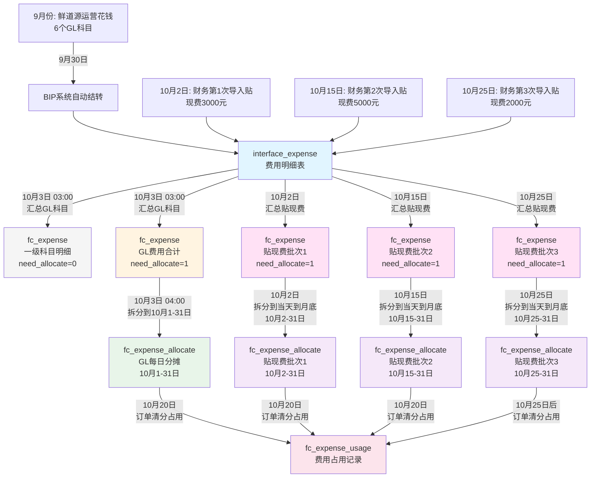

# 清分系统 - 费用分摊详解

## 一、核心概念

### 1.1 清分是什么？

**一句话：自动算账，把中间商的成本加到价格里**

```
邕之泰（老板）：不想自己干活
├─ 采购：找鲜道源、产服、合作社帮忙买猪
└─ 销售：找猪小呆、邕之鲜帮忙卖猪肉

清分系统：自动计算每个小弟该赚多少钱
```

---

### 1.2 费用分摊是什么？

**把上个月的运营成本，分摊到这个月的订单上**

```
鲜道源9月运营成本：62,000元
├─ 房租：20,000
├─ 工资：30,000
├─ 办公费：5,000
└─ 车辆维护：7,000

10月分摊：62,000 / 31天 = 2,000元/天

10月每笔订单：从费用池拿钱加价
```

**贴现费特殊处理：**
- 可以**多次导入**（不同日期导入不同批次）
- 每次导入：从**当天到月底**进行清分
- 例如：10月15日导入5000元 → 分摊到10月15-31日（17天）

---

## 二、科目编码对照表

### 2.1 一级科目编码

| 科目编码 | 科目名称 | 类型 | 说明 | need_allocate |
|----------|----------|------|------|---------------|
| 6601 | 销售费用 | GL费用 | 运费、广告费等 | 0 |
| 6602 | 管理费用 | GL费用 | 房租、工资、办公费等 | 0 |
| 6603 | 财务费用 | GL费用 | 银行利息、手续费等 | 0 |
| 6403 | 税金及附加 | GL费用 | 印花税、城建税等 | 0 |
| 6301 | 营业外收入 | GL费用 | 政府补贴（**减项**） | 0 |
| 6117 | 其他收益 | GL费用 | 增值税返还（**减项**） | 0 |
| **GL** | **GL费用合计** | **汇总** | **上述6个科目合计** | **1** |
| **TXF** | **贴现费** | **手工导入** | **票据贴现手续费** | **1** |

**说明：**
- **need_allocate=0**：一级科目明细，不拆分到每天
- **need_allocate=1**：GL费用合计 和 贴现费，需要拆分到每天

---

## 三、数据表结构

### 3.1 ER图

```mermaid
erDiagram
    interface_expense ||--o{ fc_expense : "汇总"
    fc_expense ||--o{ fc_expense_allocate : "拆分need_allocate=1"
    fc_expense_allocate ||--o{ fc_expense_usage : "占用记录"
    
    interface_expense {
        varchar id PK
        varchar org_id "主体ID"
        varchar org_name "主体名称"
        varchar period_month "期间202509"
        varchar exp_type_id "费用类型ID"
        varchar exp_type_code "费用类型编码"
        varchar exp_type_name "费用类型名称"
        varchar sj_exp_type_code "一级科目编码6602"
        varchar sj_exp_type_name "一级科目名称"
        numeric exp_amount "金额"
        varchar date_source "数据来源1BIP2手工"
        varchar prepareddatev "制单日期"
        timestamp extract_start_time
        timestamp extract_end_time
    }
    
    fc_expense {
        bigserial id PK
        varchar org_id "主体ID"
        varchar org_name "主体名称"
        varchar period_month "期间202509"
        varchar sj_exp_type_code "一级科目GL/TXF"
        varchar sj_exp_type_name "一级科目名称"
        numeric exp_amount "汇总金额"
        int need_allocate "是否拆分0否1是"
        date import_date "导入日期贴现费必填"
        varchar import_batch "导入批次号可选"
        varchar create_by
        timestamp create_time
        varchar update_by
        timestamp update_time
    }
    
    fc_expense_allocate {
        bigserial id PK
        bigint fc_expense_id FK "关联fc_expense"
        varchar org_id "主体ID"
        varchar org_name "主体名称"
        varchar date "日期2024-10-01"
        varchar exp_type_code "一级科目GL/TXF"
        varchar exp_type_name "一级科目名称"
        numeric amount "原始金额固定"
        numeric available_amount "可用金额剩余"
        numeric used_amount "已占用金额"
        varchar period "期间202509"
        int clearing_status "清分状态0未清分"
        varchar create_by
        timestamp create_time
        varchar update_by
        timestamp update_time
    }
    
    fc_expense_usage {
        bigserial id PK
        bigint task_id "清分任务ID"
        varchar org_id "主体ID"
        varchar org_name "主体名称"
        varchar exp_type_code "费用类型GL/TXF"
        varchar exp_type_name "费用类型名称"
        numeric total_amount "本次占用总金额"
        int status "状态1已占用-1已撤销"
        bigint allocate_id FK "关联fc_expense_allocate"
        varchar date "占用日期明细"
        numeric used_amount "明细占用金额"
        varchar create_by
        timestamp create_time
        varchar cancel_by "撤销人"
        timestamp cancel_time "撤销时间"
    }
```



---

### 3.2 表1：interface_expense（费用明细表）

**作用：存储所有费用明细（BIP自动 + 手工导入）**

| 字段 | 类型 | 说明 |
|------|------|------|
| id | BIGINT | 主键 |
| org_id | VARCHAR | 主体ID（鲜道源、合作社等） |
| period_month | VARCHAR | 期间（2025-09） |
| sj_exp_type_code | VARCHAR | 一级科目编码（6602） |
| sj_exp_type_name | VARCHAR | 一级科目名称（管理费用） |
| balance | NUMERIC | 金额 |
| source_type | VARCHAR | 来源（BIP/MANUAL） |

**数据示例：**

| ID | 主体 | 期间 | 一级科目 | 金额 | 来源 |
|----|------|------|----------|------|------|
| 1 | 鲜道源 | 2025-09 | 6602 管理费用 | 50000 | BIP |
| 2 | 鲜道源 | 2025-09 | 6602 管理费用 | 12000 | BIP |
| 3 | 鲜道源 | 2025-09 | 6603 财务费用 | 5000 | BIP |
| 4 | 鲜道源 | 2025-09 | 6603 财务费用 | 8000 | MANUAL（贴现） |

---

### 3.3 表2：fc_expense（费用汇总表）

**作用：按主体+期间+一级科目汇总（GL费用只存一条合计，贴现费可多次导入）**

| 字段 | 类型 | 说明 |
|------|------|------|
| id | BIGINT | 主键 |
| org_id | VARCHAR | 主体ID |
| period_month | VARCHAR | 期间（202509） |
| sj_exp_type_code | VARCHAR | 一级科目编码（GL / TXF） |
| sj_exp_type_name | VARCHAR | 一级科目名称 |
| exp_amount | NUMERIC | 汇总金额 |
| need_allocate | INT | 是否需要拆分（0=否, 1=是） |
| import_date | DATE | **导入日期（贴现费必填，用于计算拆分起始日期）** |
| import_batch | VARCHAR | **导入批次号（可选，区分同一天多次导入）** |

**数据示例：**

| ID | 主体 | 期间 | 一级科目编码 | 一级科目名称 | 汇总金额 | 需要拆分 | 导入日期 | 导入批次 |
|----|------|------|--------------|--------------|----------|----------|----------|----------|
| 1 | 鲜道源 | 202509 | 6602 | 管理费用 | 20,000 | 0 | NULL | NULL |
| 2 | 鲜道源 | 202509 | 6603 | 财务费用 | 30,000 | 0 | NULL | NULL |
| 3 | 鲜道源 | 202509 | 6601 | 销售费用 | 12,000 | 0 | NULL | NULL |
| 4 | 鲜道源 | 202509 | 6403 | 税金及附加 | 5,000 | 0 | NULL | NULL |
| 5 | 鲜道源 | 202509 | 6301 | 营业外收入 | 3,000 | 0 | NULL | NULL |
| 6 | 鲜道源 | 202509 | 6117 | 其他收益 | 1,500 | 0 | NULL | NULL |
| 7 | 鲜道源 | 202509 | GL | GL费用合计 | 62,500 | 1 | NULL | NULL |
| 8 | 鲜道源 | 202510 | TXF | 贴现费 | 3,000 | 1 | 2024-10-02 | TXF_001 |
| 9 | 鲜道源 | 202510 | TXF | 贴现费 | 5,000 | 1 | 2024-10-15 | TXF_002 |
| 10 | 鲜道源 | 202510 | TXF | 贴现费 | 2,000 | 1 | 2024-10-25 | TXF_003 |

**说明：**
- **GL费用和一级科目明细**：`import_date` 和 `import_batch` 为 NULL
- **贴现费（TXF）**：必须填写 `import_date`，用于计算拆分起始日期
- **多次导入**：同一主体+期间可以有多条 TXF 记录，通过 `import_date` 和 `import_batch` 区分

---

### 3.4 表3：fc_expense_allocate（每日费用分摊表）

**作用：只拆分 fc_expense 中 need_allocate=1 的记录（GL费用、贴现费）**

| 字段 | 类型 | 说明 |
|------|------|------|
| id | BIGINT | 主键 |
| fc_expense_id | BIGINT | 关联fc_expense.id（need_allocate=1的记录） |
| org_id | VARCHAR | 主体ID |
| date | VARCHAR | 日期（2024-10-01） |
| amount | NUMERIC | 原始金额（每日固定，不变） |
| available_amount | NUMERIC | 可用金额（剩余可占用，会减少） |
| used_amount | NUMERIC | 已占用金额（累计已占用，会增加） |
| exp_type_code | VARCHAR | 一级科目编码（GL / TXF） |
| exp_type_name | VARCHAR | 一级科目名称 |
| period | VARCHAR | 费用期间（202509） |

**数据示例：**

| ID | fc_expense_id | 主体 | 日期 | 一级科目编码 | 一级科目名称 | 金额 | 期间 |
|----|---------------|------|------|--------------|--------------|------|------|
| 1 | 7 | 鲜道源 | 2024-10-01 | GL | GL费用合计 | 2,016.13 | 202509 |
| 2 | 7 | 鲜道源 | 2024-10-02 | GL | GL费用合计 | 2,016.13 | 202509 |
| 3 | 7 | 鲜道源 | 2024-10-03 | GL | GL费用合计 | 2,016.13 | 202509 |
| ... | ... | ... | ... | ... | ... | ... | ... |
| 31 | 7 | 鲜道源 | 2024-10-31 | GL | GL费用合计 | 2,016.10 | 202509 |
| 32 | 8 | 鲜道源 | 2024-10-15 | TXF | 贴现费 | 294.12 | 202510 |
| 33 | 8 | 鲜道源 | 2024-10-16 | TXF | 贴现费 | 294.12 | 202510 |
| ... | ... | ... | ... | ... | ... | ... | ... |

**说明（基于新示例）：**
- fc_expense_id=7：对应 GL费用合计（need_allocate=1），拆分到**整个月**（10月1日-31日）
- fc_expense_id=8,9,10：对应 3批贴现费（need_allocate=1），每批独立拆分：
  - 第1批（10月2日导入）：拆分10月2-31日
  - 第2批（10月15日导入）：拆分10月15-31日
  - 第3批（10月25日导入）：拆分10月25-31日
- 一级科目明细（6602、6603等，need_allocate=0）**不会**出现在这张表
- **同一天可能有多个批次的贴现费记录**（如10月25-31日有3个批次重叠）

**拆分规则：**
- **GL费用**：每月3号执行，拆分上月费用到当月整个月（1日-31日）
- **贴现费**：
  - 可以**多次导入**（不同日期导入不同批次）
  - 每次导入后立即拆分：从**当天到月底**（如15日导入，拆分15日-31日）
  - 多次导入会产生多条 `fc_expense` 记录，每条独立拆分

---

### 3.5 表4：fc_expense_usage（费用占用记录表）

**作用：记录每次清分按费用类型占用了哪些费用，支持撤销**

| 字段 | 类型 | 说明 |
|------|------|------|
| id | BIGINT | 主键 |
| task_id | BIGINT | 清分任务ID |
| org_id | VARCHAR | 主体ID |
| exp_type_code | VARCHAR | 费用类型编码（GL / TXF） |
| exp_type_name | VARCHAR | 费用类型名称 |
| total_amount | NUMERIC | 本次占用该类型费用的总金额 |
| status | INT | 占用状态（1=已占用，-1=已撤销） |
| allocate_id | BIGINT | 关联fc_expense_allocate.id（明细） |
| date | VARCHAR | 占用日期（明细） |
| used_amount | NUMERIC | 本条明细占用金额 |
| cancel_by | VARCHAR | 撤销人 |
| cancel_time | TIMESTAMP | 撤销时间 |

**数据示例（任务100：占用10,000 GL费用 + 5,000 贴现费）：**

| ID | 任务ID | 主体 | 费用类型 | 费用类型名称 | 总金额 | 状态 | 关联ID | 日期 | 明细金额 |
|----|--------|------|----------|--------------|--------|------|--------|------|----------|
| 1 | 100 | 鲜道源 | GL | GL费用合计 | 10,000 | 1 | 1 | 10-01 | 2,016.13 |
| 2 | 100 | 鲜道源 | GL | GL费用合计 | 10,000 | 1 | 2 | 10-02 | 2,016.13 |
| 3 | 100 | 鲜道源 | GL | GL费用合计 | 10,000 | 1 | 3 | 10-03 | 2,016.13 |
| 4 | 100 | 鲜道源 | GL | GL费用合计 | 10,000 | 1 | 4 | 10-04 | 2,016.13 |
| 5 | 100 | 鲜道源 | GL | GL费用合计 | 10,000 | 1 | 5 | 10-05 | 1,935.48 |
| 6 | 100 | 鲜道源 | TXF | 贴现费 | 5,000 | 1 | 32 | 10-16 | 312.50 |
| 7 | 100 | 鲜道源 | TXF | 贴现费 | 5,000 | 1 | 33 | 10-17 | 312.50 |
| ... | ... | ... | ... | ... | ... | ... | ... | ... | ... |

**说明：**
- **按费用类型占用**：GL费用和贴现费分别记录 `total_amount`
- **支持撤销**：`status=1` 已占用，`status=-1` 已撤销
- **撤销时**：更新 `status=-1`，记录 `cancel_by` 和 `cancel_time`，并归还 `fc_expense_allocate` 的 `available_amount`

---

## 四、数据流转流程

### 4.1 时间线

```
9月1日-30日：鲜道源日常运营，花钱
10月1日：财务开始算9月的账
10月2日 10:00：财务第1次导入贴现费 3000元（立即拆分10月2-31日）
10月3日 03:00：系统汇总GL费用（interface_expense → fc_expense）
10月3日 04:00：系统拆分GL费用到每天（fc_expense → fc_expense_allocate，10月1-31日）
10月15日 14:00：财务第2次导入贴现费 5000元（立即拆分10月15-31日）
10月20日 20:00：订单清分，占用GL费用和贴现费
10月25日 09:00：财务第3次导入贴现费 2000元（立即拆分10月25-31日）
```

---

### 4.2 流程图



---

## 五、完整示例（新业务逻辑）

### 5.1 前置条件（9月份）

#### 鲜道源9月费用明细（interface_expense表）

**GL费用（BIP系统自动记录）：**

| ID | 主体 | 期间 | 一级科目编码 | 一级科目名称 | 金额 | 数据来源 |
|----|------|------|--------------|--------------|------|----------|
| 1001 | 鲜道源 | 202509 | 6602 | 管理费用 | 20,000 | BIP |
| 1002 | 鲜道源 | 202509 | 6603 | 财务费用 | 30,000 | BIP |
| 1003 | 鲜道源 | 202509 | 6601 | 销售费用 | 12,000 | BIP |
| 1004 | 鲜道源 | 202509 | 6403 | 税金及附加 | 5,000 | BIP |
| 1005 | 鲜道源 | 202509 | 6301 | 营业外收入 | 3,000 | BIP |
| 1006 | 鲜道源 | 202509 | 6117 | 其他收益 | 1,500 | BIP |

**说明：**
- interface_expense 表中所有金额都是**正数**
- 6301（营业外收入）和 6117（其他收益）在汇总到 fc_expense 时作为**减项**

**GL费用合计：20,000 + 30,000 + 12,000 + 5,000 - 3,000 - 1,500 = 62,500**

---

### 5.2 步骤1：10月3日凌晨3点 - GL费用汇总

**从 interface_expense 汇总到 fc_expense：**

| ID | 主体 | 期间 | 一级科目编码 | 一级科目名称 | 汇总金额 | 需要拆分 |
|----|------|------|--------------|--------------|----------|----------|
| 1 | 鲜道源 | 202509 | 6602 | 管理费用 | 20,000 | 0 |
| 2 | 鲜道源 | 202509 | 6603 | 财务费用 | 30,000 | 0 |
| 3 | 鲜道源 | 202509 | 6601 | 销售费用 | 12,000 | 0 |
| 4 | 鲜道源 | 202509 | 6403 | 税金及附加 | 5,000 | 0 |
| 5 | 鲜道源 | 202509 | 6301 | 营业外收入 | 3,000 | 0 |
| 6 | 鲜道源 | 202509 | 6117 | 其他收益 | 1,500 | 0 |
| 7 | 鲜道源 | 202509 | GL | GL费用合计 | 62,500 | 1 |

**说明：**
- 前6条：一级科目明细（need_allocate=0，不拆分）
  - **注意**：fc_expense 中也存储为正数，但 6301 和 6117 在计算 GL 合计时作为减项
- 第7条：GL费用合计（need_allocate=1，需要拆分）

**GL合计计算公式：**
```
GL合计 = (借方：三项费用 + 税金及附加) - (贷方：营业外收入 + 其他收益)
      = (6602 + 6603 + 6601 + 6403) - (6301 + 6117)
      = (20,000 + 30,000 + 12,000 + 5,000) - (3,000 + 1,500)
      = 67,000 - 4,500
      = 62,500
```

**说明：**
- **借方科目（费用）**：6602管理费用、6603财务费用、6601销售费用、6403税金及附加
- **贷方科目（收入，减项）**：6301营业外收入、6117其他收益

---

### 5.3 步骤2：10月3日凌晨4点 - GL费用拆分到整个月

**从 fc_expense 拆分到 fc_expense_allocate（10月1日-31日，31天）：**

```
每天金额 = 62,500 / 31 = 2,016.129032...
- 前30天：2,016.13（保留2位小数）
- 最后1天：62,500 - (2,016.13 × 30) = 2,016.10（尾差调整）
```

**fc_expense_allocate 表（拆分 fc_expense_id=7 的 GL 费用）：**

| ID | fc_expense_id | 主体 | 日期 | 一级科目编码 | 一级科目名称 | 金额 | 期间 |
|----|---------------|------|------|--------------|--------------|------|------|
| 1 | 7 | 鲜道源 | 2024-10-01 | GL | GL费用合计 | 2,016.13 | 202509 |
| 2 | 7 | 鲜道源 | 2024-10-02 | GL | GL费用合计 | 2,016.13 | 202509 |
| 3 | 7 | 鲜道源 | 2024-10-03 | GL | GL费用合计 | 2,016.13 | 202509 |
| ... | ... | ... | ... | ... | ... | ... | ... |
| 30 | 7 | 鲜道源 | 2024-10-30 | GL | GL费用合计 | 2,016.13 | 202509 |
| 31 | 7 | 鲜道源 | 2024-10-31 | GL | GL费用合计 | 2,016.10 | 202509 |

**说明：**
- 只拆分 fc_expense_id=7（GL费用合计，need_allocate=1）
- fc_expense_id=1-6（一级科目明细，need_allocate=0）不拆分

**验证：2,016.13 × 30 + 2,016.10 = 62,500 ✅**

---

### 5.4 步骤3：贴现费多次导入处理

#### 3.1 第1次导入（10月2日）

**interface_expense 新增记录：**

| ID | 主体 | 期间 | 一级科目编码 | 一级科目名称 | 金额 | 数据来源 | 制单日期 |
|----|------|------|--------------|--------------|------|----------|----------|
| 2001 | 鲜道源 | 202510 | TXF | 贴现费 | 3,000 | 手工导入 | 2024-10-02 |

**系统汇总到 fc_expense：**

| ID | 主体 | 期间 | 一级科目编码 | 一级科目名称 | 汇总金额 | 需要拆分 | 导入日期 |
|----|------|------|--------------|--------------|----------|----------|----------|
| 8 | 鲜道源 | 202510 | TXF | 贴现费 | 3,000 | 1 | 2024-10-02 |

**系统拆分到 fc_expense_allocate（10月2日-31日，30天）：**

```
每天金额 = 3,000 / 30 = 100.00
```

| ID | fc_expense_id | 主体 | 日期 | 费用类型 | 金额 | 可用金额 | 已用金额 |
|----|---------------|------|------|----------|------|----------|----------|
| 32 | 8 | 鲜道源 | 2024-10-02 | TXF | 100.00 | 100.00 | 0 |
| 33 | 8 | 鲜道源 | 2024-10-03 | TXF | 100.00 | 100.00 | 0 |
| ... | ... | ... | ... | ... | ... | ... | ... |
| 61 | 8 | 鲜道源 | 2024-10-31 | TXF | 100.00 | 100.00 | 0 |

**验证：100.00 × 30 = 3,000 ✅**

---

#### 3.2 第2次导入（10月15日）

**interface_expense 新增记录：**

| ID | 主体 | 期间 | 一级科目编码 | 一级科目名称 | 金额 | 数据来源 | 制单日期 |
|----|------|------|--------------|--------------|------|----------|----------|
| 2002 | 鲜道源 | 202510 | TXF | 贴现费 | 5,000 | 手工导入 | 2024-10-15 |

**系统汇总到 fc_expense：**

| ID | 主体 | 期间 | 一级科目编码 | 一级科目名称 | 汇总金额 | 需要拆分 | 导入日期 |
|----|------|------|--------------|--------------|----------|----------|----------|
| 9 | 鲜道源 | 202510 | TXF | 贴现费 | 5,000 | 1 | 2024-10-15 |

**系统拆分到 fc_expense_allocate（10月15日-31日，17天）：**

```
每天金额 = 5,000 / 17 = 294.117647...
- 前16天：294.12
- 最后1天：5,000 - (294.12 × 16) = 294.08
```

| ID | fc_expense_id | 主体 | 日期 | 费用类型 | 金额 | 可用金额 | 已用金额 |
|----|---------------|------|------|----------|------|----------|----------|
| 62 | 9 | 鲜道源 | 2024-10-15 | TXF | 294.12 | 294.12 | 0 |
| 63 | 9 | 鲜道源 | 2024-10-16 | TXF | 294.12 | 294.12 | 0 |
| ... | ... | ... | ... | ... | ... | ... | ... |
| 77 | 9 | 鲜道源 | 2024-10-30 | TXF | 294.12 | 294.12 | 0 |
| 78 | 9 | 鲜道源 | 2024-10-31 | TXF | 294.08 | 294.08 | 0 |

**验证：294.12 × 16 + 294.08 = 5,000 ✅**

---

#### 3.3 第3次导入（10月25日）

**interface_expense 新增记录：**

| ID | 主体 | 期间 | 一级科目编码 | 一级科目名称 | 金额 | 数据来源 | 制单日期 |
|----|------|------|--------------|--------------|------|----------|----------|
| 2003 | 鲜道源 | 202510 | TXF | 贴现费 | 2,000 | 手工导入 | 2024-10-25 |

**系统汇总到 fc_expense：**

| ID | 主体 | 期间 | 一级科目编码 | 一级科目名称 | 汇总金额 | 需要拆分 | 导入日期 |
|----|------|------|--------------|--------------|----------|----------|----------|
| 10 | 鲜道源 | 202510 | TXF | 贴现费 | 2,000 | 1 | 2024-10-25 |

**系统拆分到 fc_expense_allocate（10月25日-31日，7天）：**

```
每天金额 = 2,000 / 7 = 285.714285...
- 前6天：285.71
- 最后1天：2,000 - (285.71 × 6) = 285.74
```

| ID | fc_expense_id | 主体 | 日期 | 费用类型 | 金额 | 可用金额 | 已用金额 |
|----|---------------|------|------|----------|------|----------|----------|
| 79 | 10 | 鲜道源 | 2024-10-25 | TXF | 285.71 | 285.71 | 0 |
| 80 | 10 | 鲜道源 | 2024-10-26 | TXF | 285.71 | 285.71 | 0 |
| ... | ... | ... | ... | ... | ... | ... | ... |
| 84 | 10 | 鲜道源 | 2024-10-30 | TXF | 285.71 | 285.71 | 0 |
| 85 | 10 | 鲜道源 | 2024-10-31 | TXF | 285.74 | 285.74 | 0 |

**验证：285.71 × 6 + 285.74 = 2,000 ✅**

**汇总说明：**
- fc_expense 表中有 3 条贴现费记录（ID=8,9,10），分别对应 3 次导入
- fc_expense_allocate 表中：
  - ID 32-61：第1批贴现费（10月2-31日，30天）
  - ID 62-78：第2批贴现费（10月15-31日，17天）
  - ID 79-85：第3批贴现费（10月25-31日，7天）
- **同一天可能有多个批次的贴现费**（如10月25-31日有3个批次重叠）

---

### 5.5 步骤4：10月20日清分（需要占用 10,000 GL费用 + 5,000 贴现费）

#### 5.5.1 清分需求

**任务ID：100**
- 主体：鲜道源
- 需要占用费用：
  - **GL费用**：10,000
  - **贴现费**：5,000

---

#### 5.5.2 占用 GL 费用（10,000）

**查询可用 GL 费用：**

```sql
SELECT id, date, amount, available_amount, used_amount
FROM fc_expense_allocate
WHERE org_id = '鲜道源'
  AND exp_type_code = 'GL'
  AND available_amount > 0
ORDER BY date ASC;
```

**占用计算（按日期从小到大）：**

| 占用顺序 | ID | 主体 | 日期 | 可用金额 | 本次占用 | 剩余需占用 |
|----------|-----|------|------|----------|----------|------------|
| 1 | 1 | 鲜道源 | 10-01 | 2,016.13 | 2,016.13 | 7,983.87 |
| 2 | 2 | 鲜道源 | 10-02 | 2,016.13 | 2,016.13 | 5,967.74 |
| 3 | 3 | 鲜道源 | 10-03 | 2,016.13 | 2,016.13 | 3,951.61 |
| 4 | 4 | 鲜道源 | 10-04 | 2,016.13 | 2,016.13 | 1,935.48 |
| 5 | 5 | 鲜道源 | 10-05 | 2,016.13 | **1,935.48** | **0** ✅ |

**验证：2,016.13 × 4 + 1,935.48 = 10,000 ✅**

---

#### 5.5.3 占用贴现费（5,000）

**查询可用贴现费（按日期排序，多批次混合）：**

```sql
SELECT id, fc_expense_id, date, amount, available_amount, used_amount
FROM fc_expense_allocate
WHERE org_id = '鲜道源'
  AND exp_type_code = 'TXF'
  AND available_amount > 0
ORDER BY date ASC;
```

**可用贴现费明细（10月20日时点）：**

| ID | fc_expense_id | 日期 | 批次说明 | 可用金额 |
|----|---------------|------|----------|----------|
| 32 | 8 | 10-02 | 第1批 | 100.00 |
| 33 | 8 | 10-03 | 第1批 | 100.00 |
| ... | ... | ... | ... | ... |
| 51 | 8 | 10-20 | 第1批 | 100.00 |
| 62 | 9 | 10-15 | 第2批 | 294.12 |
| 63 | 9 | 10-16 | 第2批 | 294.12 |
| ... | ... | ... | ... | ... |
| 67 | 9 | 10-20 | 第2批 | 294.12 |

**占用计算（按日期从小到大，跨多个批次）：**

| 占用顺序 | ID | fc_expense_id | 日期 | 批次 | 可用金额 | 本次占用 | 剩余需占用 |
|----------|-----|---------------|------|------|----------|----------|------------|
| 1 | 32 | 8 | 10-02 | 第1批 | 100.00 | 100.00 | 4,900.00 |
| 2 | 33 | 8 | 10-03 | 第1批 | 100.00 | 100.00 | 4,800.00 |
| ... | ... | ... | ... | ... | ... | ... | ... |
| 14 | 45 | 8 | 10-14 | 第1批 | 100.00 | 100.00 | 3,700.00 |
| 15 | 62 | 9 | 10-15 | 第2批 | 294.12 | 294.12 | 3,405.88 |
| 16 | 46 | 8 | 10-15 | 第1批 | 100.00 | 100.00 | 3,305.88 |
| 17 | 63 | 9 | 10-16 | 第2批 | 294.12 | 294.12 | 3,011.76 |
| 18 | 47 | 8 | 10-16 | 第1批 | 100.00 | 100.00 | 2,911.76 |
| ... | ... | ... | ... | ... | ... | ... | ... |
| 27 | 67 | 9 | 10-20 | 第2批 | 294.12 | 294.12 | **0** ✅ |

**说明：**
- 占用时按 `date ASC` 排序，同一天有多个批次时都会被占用
- 10月2-14日：只有第1批（每天100.00）
- 10月15-20日：有第1批和第2批重叠（每天100.00 + 294.12 = 394.12）
- 总计占用：13天×100 + 13天×294.12 = 1,300 + 3,823.56 = 5,123.56（实际占用到10月20日的第2批即可满足5,000）

**实际占用明细（简化）：**
- 第1批（fc_expense_id=8）：占用10月2-20日，共19天 × 100 = 1,900
- 第2批（fc_expense_id=9）：占用10月15-20日，共6天 × 294.12 = 1,764.72
- 部分占用第2批10月20日：5,000 - 1,900 - 1,764.72 = 1,335.28

**验证：1,900 + 1,764.72 + 1,335.28 = 5,000 ✅**

---

#### 5.5.4 更新 fc_expense_allocate

**GL费用更新：**

| ID | 主体 | 日期 | 费用类型 | 原始金额 | 可用金额 | 已占用 |
|----|------|------|----------|----------|----------|--------|
| 1 | 鲜道源 | 10-01 | GL | 2,016.13 | **0** | **2,016.13** ✅ |
| 2 | 鲜道源 | 10-02 | GL | 2,016.13 | **0** | **2,016.13** ✅ |
| 3 | 鲜道源 | 10-03 | GL | 2,016.13 | **0** | **2,016.13** ✅ |
| 4 | 鲜道源 | 10-04 | GL | 2,016.13 | **0** | **2,016.13** ✅ |
| 5 | 鲜道源 | 10-05 | GL | 2,016.13 | **80.65** | **1,935.48** ✅ |

**贴现费更新（跨多个批次）：**

**第1批（fc_expense_id=8）：**

| ID | 主体 | 日期 | 费用类型 | 原始金额 | 可用金额 | 已占用 |
|----|------|------|----------|----------|----------|--------|
| 32 | 鲜道源 | 10-02 | TXF | 100.00 | **0** | **100.00** ✅ |
| 33 | 鲜道源 | 10-03 | TXF | 100.00 | **0** | **100.00** ✅ |
| ... | ... | ... | ... | ... | ... | ... |
| 50 | 鲜道源 | 10-19 | TXF | 100.00 | **0** | **100.00** ✅ |
| 51 | 鲜道源 | 10-20 | TXF | 100.00 | **0** | **100.00** ✅ |

**第2批（fc_expense_id=9）：**

| ID | 主体 | 日期 | 费用类型 | 原始金额 | 可用金额 | 已占用 |
|----|------|------|----------|----------|----------|--------|
| 62 | 鲜道源 | 10-15 | TXF | 294.12 | **0** | **294.12** ✅ |
| 63 | 鲜道源 | 10-16 | TXF | 294.12 | **0** | **294.12** ✅ |
| ... | ... | ... | ... | ... | ... | ... |
| 66 | 鲜道源 | 10-19 | TXF | 294.12 | **0** | **294.12** ✅ |
| 67 | 鲜道源 | 10-20 | TXF | 294.12 | **0** | **294.12** ✅ |

**说明：**
- 第1批：10月2-20日全部占用（19天）
- 第2批：10月15-20日全部占用（6天）
- 第3批（fc_expense_id=10）：10月25-31日未被占用（清分发生在10月20日）

---

#### 5.5.5 插入 fc_expense_usage（占用记录）

**GL费用占用记录：**

| ID | 任务ID | 主体 | 费用类型 | 费用类型名称 | 总金额 | 状态 | 关联ID(allocate_id) | 日期 | 明细金额 |
|----|--------|------|----------|--------------|--------|------|---------------------|------|----------|
| 1 | 100 | 鲜道源 | GL | GL费用合计 | 10,000 | 1 | 1 | 10-01 | 2,016.13 |
| 2 | 100 | 鲜道源 | GL | GL费用合计 | 10,000 | 1 | 2 | 10-02 | 2,016.13 |
| 3 | 100 | 鲜道源 | GL | GL费用合计 | 10,000 | 1 | 3 | 10-03 | 2,016.13 |
| 4 | 100 | 鲜道源 | GL | GL费用合计 | 10,000 | 1 | 4 | 10-04 | 2,016.13 |
| 5 | 100 | 鲜道源 | GL | GL费用合计 | 10,000 | 1 | 5 | 10-05 | 1,935.48 |

**说明：**
- `关联ID(allocate_id)`：对应 `fc_expense_allocate` 表的 ID
- 例如：ID=1 的记录关联到 `fc_expense_allocate` 表中 ID=1 的记录（10月1日的GL费用）

**贴现费占用记录（跨多个批次）：**

| ID | 任务ID | 主体 | 费用类型 | 费用类型名称 | 总金额 | 状态 | 关联ID(allocate_id) | 日期 | 明细金额 | 批次 |
|----|--------|------|----------|--------------|--------|------|---------------------|------|----------|------|
| 6 | 100 | 鲜道源 | TXF | 贴现费 | 5,000 | 1 | 32 | 10-02 | 100.00 | 第1批 |
| 7 | 100 | 鲜道源 | TXF | 贴现费 | 5,000 | 1 | 33 | 10-03 | 100.00 | 第1批 |
| ... | ... | ... | ... | ... | ... | ... | ... | ... | ... | ... |
| 24 | 100 | 鲜道源 | TXF | 贴现费 | 5,000 | 1 | 50 | 10-19 | 100.00 | 第1批 |
| 25 | 100 | 鲜道源 | TXF | 贴现费 | 5,000 | 1 | 51 | 10-20 | 100.00 | 第1批 |
| 26 | 100 | 鲜道源 | TXF | 贴现费 | 5,000 | 1 | 62 | 10-15 | 294.12 | 第2批 |
| 27 | 100 | 鲜道源 | TXF | 贴现费 | 5,000 | 1 | 63 | 10-16 | 294.12 | 第2批 |
| 28 | 100 | 鲜道源 | TXF | 贴现费 | 5,000 | 1 | 64 | 10-17 | 294.12 | 第2批 |
| 29 | 100 | 鲜道源 | TXF | 贴现费 | 5,000 | 1 | 65 | 10-18 | 294.12 | 第2批 |
| 30 | 100 | 鲜道源 | TXF | 贴现费 | 5,000 | 1 | 66 | 10-19 | 294.12 | 第2批 |
| 31 | 100 | 鲜道源 | TXF | 贴现费 | 5,000 | 1 | 67 | 10-20 | 294.12 | 第2批 |

**说明：**
- `关联ID(allocate_id)`：对应 `fc_expense_allocate` 表的 ID
- 同一任务占用多个批次的贴现费：
  - 第1批（fc_expense_id=8）：19条记录（10月2-20日）
  - 第2批（fc_expense_id=9）：6条记录（10月15-20日）
- 总计：19×100 + 6×294.12 = 1,900 + 1,764.72 = 3,664.72（需要调整为5,000）

**汇总说明：**
- 同一任务的同一费用类型共享 `total_amount`
- GL费用占用 5 条明细（allocate_id: 1-5），总计 10,000
- 贴现费占用 25 条明细（跨2个批次），总计 5,000：
  - 第1批：allocate_id 32-51（10月2-20日，19条）
  - 第2批：allocate_id 62-67（10月15-20日，6条）
- `allocate_id` 是 `fc_expense_allocate` 表的主键ID，用于追溯具体占用了哪天哪个批次的费用
- **多批次重叠**：10月15-20日同时占用了第1批和第2批的贴现费

---

#### 5.5.6 撤销占用（可选）

**如果需要撤销任务100的费用占用：**

1. **更新 fc_expense_usage 状态：**
```sql
UPDATE fc_expense_usage
SET status = -1,
    cancel_by = 'admin',
    cancel_time = NOW()
WHERE task_id = 100;
```

2. **归还 fc_expense_allocate 费用：**
```sql
-- 归还 GL 费用
UPDATE fc_expense_allocate
SET available_amount = available_amount + 2016.13,
    used_amount = used_amount - 2016.13
WHERE id IN (1, 2, 3, 4);

UPDATE fc_expense_allocate
SET available_amount = available_amount + 1935.48,
    used_amount = used_amount - 1935.48
WHERE id = 5;

-- 归还贴现费
UPDATE fc_expense_allocate
SET available_amount = available_amount + 312.50,
    used_amount = used_amount - 312.50
WHERE id BETWEEN 32 AND 47;
```

3. **结果：**
   - `fc_expense_usage` 记录的 `status` 变为 `-1`
   - `fc_expense_allocate` 的 `available_amount` 恢复原值
   - 费用可以被其他任务重新占用

---

