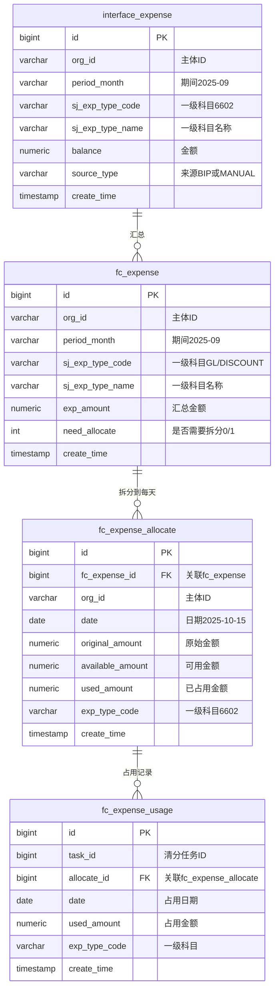
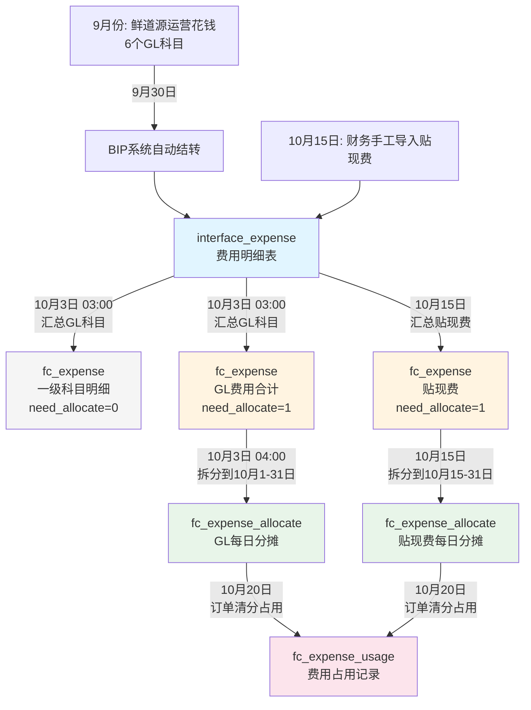

# 清分系统 - 费用分摊详解

## 一、核心概念

### 1.1 清分是什么？

**一句话：自动算账，把中间商的成本加到价格里**

```
邕之泰（老板）：不想自己干活
├─ 采购：找鲜道源、产服、合作社帮忙买猪
└─ 销售：找猪小呆、邕之鲜帮忙卖猪肉

清分系统：自动计算每个小弟该赚多少钱
```

---

### 1.2 费用分摊是什么？

**把上个月的运营成本，分摊到这个月的订单上**

```
鲜道源9月运营成本：62,000元
├─ 房租：20,000
├─ 工资：30,000
├─ 办公费：5,000
└─ 车辆维护：7,000

10月分摊：62,000 / 31天 = 2,000元/天

10月每笔订单：从费用池拿钱加价
```

---

## 二、数据表结构

### 2.1 ER图



---

### 2.2 表1：interface_expense（费用明细表）

**作用：存储所有费用明细（BIP自动 + 手工导入）**

| 字段 | 类型 | 说明 |
|------|------|------|
| id | BIGINT | 主键 |
| org_id | VARCHAR | 主体ID（鲜道源、合作社等） |
| period_month | VARCHAR | 期间（2025-09） |
| sj_exp_type_code | VARCHAR | 一级科目编码（6602） |
| sj_exp_type_name | VARCHAR | 一级科目名称（管理费用） |
| balance | NUMERIC | 金额 |
| source_type | VARCHAR | 来源（BIP/MANUAL） |

**数据示例：**

| ID | 主体 | 期间 | 一级科目 | 金额 | 来源 |
|----|------|------|----------|------|------|
| 1 | 鲜道源 | 2025-09 | 6602 管理费用 | 50000 | BIP |
| 2 | 鲜道源 | 2025-09 | 6602 管理费用 | 12000 | BIP |
| 3 | 鲜道源 | 2025-09 | 6603 财务费用 | 5000 | BIP |
| 4 | 鲜道源 | 2025-09 | 6603 财务费用 | 8000 | MANUAL（贴现） |

---

### 2.3 表2：fc_expense（费用汇总表）

**作用：按主体+期间+一级科目汇总（GL费用只存一条合计）**

| 字段 | 类型 | 说明 |
|------|------|------|
| id | BIGINT | 主键 |
| org_id | VARCHAR | 主体ID |
| period_month | VARCHAR | 期间（202509） |
| sj_exp_type_code | VARCHAR | 一级科目编码（GL / DISCOUNT） |
| sj_exp_type_name | VARCHAR | 一级科目名称 |
| exp_amount | NUMERIC | 汇总金额 |
| need_allocate | INT | 是否需要拆分（0=否, 1=是） |

**数据示例：**

| ID | 主体 | 期间 | 一级科目编码 | 一级科目名称 | 汇总金额 | 需要拆分 |
|----|------|------|--------------|--------------|----------|----------|
| 1 | 鲜道源 | 202509 | 6602 | 管理费用 | 20,000 | 0 |
| 2 | 鲜道源 | 202509 | 6603 | 财务费用 | 30,000 | 0 |
| 3 | 鲜道源 | 202509 | 6601 | 销售费用 | 12,000 | 0 |
| 4 | 鲜道源 | 202509 | 6403 | 税金及附加 | 5,000 | 0 |
| 5 | 鲜道源 | 202509 | 6301 | 营业外收入 | -3,000 | 0 |
| 6 | 鲜道源 | 202509 | 6117 | 其他收益 | -1,500 | 0 |
| 7 | 鲜道源 | 202509 | GL | GL费用合计 | 62,500 | 1 |
| 8 | 鲜道源 | 202510 | DISCOUNT | 贴现费 | 5,000 | 1 |

---

### 2.4 表3：fc_expense_allocate（每日费用分摊表）

**作用：只拆分 fc_expense 中 need_allocate=1 的记录（GL费用、贴现费）**

| 字段 | 类型 | 说明 |
|------|------|------|
| id | BIGINT | 主键 |
| fc_expense_id | BIGINT | 关联fc_expense.id（need_allocate=1的记录） |
| org_id | VARCHAR | 主体ID |
| date | VARCHAR | 日期（2024-10-01） |
| amount | NUMERIC | 每日金额 |
| exp_type_code | VARCHAR | 一级科目编码（GL / DISCOUNT） |
| exp_type_name | VARCHAR | 一级科目名称 |
| period | VARCHAR | 费用期间（202509） |

**数据示例：**

| ID | fc_expense_id | 主体 | 日期 | 一级科目编码 | 一级科目名称 | 金额 | 期间 |
|----|---------------|------|------|--------------|--------------|------|------|
| 1 | 7 | 鲜道源 | 2024-10-01 | GL | GL费用合计 | 2,016.13 | 202509 |
| 2 | 7 | 鲜道源 | 2024-10-02 | GL | GL费用合计 | 2,016.13 | 202509 |
| 3 | 7 | 鲜道源 | 2024-10-03 | GL | GL费用合计 | 2,016.13 | 202509 |
| ... | ... | ... | ... | ... | ... | ... | ... |
| 31 | 7 | 鲜道源 | 2024-10-31 | GL | GL费用合计 | 2,016.10 | 202509 |
| 32 | 8 | 鲜道源 | 2024-10-15 | DISCOUNT | 贴现费 | 294.12 | 202510 |
| 33 | 8 | 鲜道源 | 2024-10-16 | DISCOUNT | 贴现费 | 294.12 | 202510 |
| ... | ... | ... | ... | ... | ... | ... | ... |

**说明：**
- fc_expense_id=7：对应 GL费用合计（need_allocate=1），拆分到**整个月**（10月1日-31日）
- fc_expense_id=8：对应 贴现费（need_allocate=1），拆分到**从当天到月底**（10月15日-31日）
- 一级科目明细（6602、6603等，need_allocate=0）**不会**出现在这张表

**拆分规则：**
- **GL费用**：每月3号执行，拆分上月费用到当月整个月（1日-31日）
- **贴现费**：每天执行，拆分当天导入的贴现费到从当天到月底（如15日导入，拆分15日-31日）

---

### 2.5 表4：fc_expense_usage（费用占用记录表）

**作用：记录每次清分占用了哪些费用**

| 字段 | 类型 | 说明 |
|------|------|------|
| id | BIGINT | 主键 |
| task_id | BIGINT | 清分任务ID |
| allocate_id | BIGINT | 关联fc_expense_allocate.id |
| date | DATE | 占用日期 |
| used_amount | NUMERIC | 占用金额 |
| exp_type_code | VARCHAR | 一级科目编码 |

**数据示例：**

| ID | 任务ID | 关联ID | 日期 | 占用金额 | 一级科目 |
|----|--------|--------|------|----------|----------|
| 1 | 100 | 1 | 10-01 | 2000 | 6602 |
| 2 | 100 | 2 | 10-02 | 2000 | 6602 |
| 3 | 100 | 3 | 10-03 | 2000 | 6602 |
| 4 | 100 | 4 | 10-04 | 500 | 6602 |

---

## 三、数据流转流程

### 3.1 时间线

```
9月1日-30日：鲜道源日常运营，花钱
10月1日：财务开始算9月的账
10月2日：财务导入贴现费
10月3日 03:00：系统汇总费用（interface_expense → fc_expense）
10月3日 04:00：系统拆分到每天（fc_expense → fc_expense_allocate）
10月15日 20:00：订单清分，占用费用
```

---

### 3.2 流程图



---

## 四、完整示例（新业务逻辑）

### 4.1 前置条件（9月份）

#### 鲜道源9月费用明细（interface_expense表）

**GL费用（BIP系统自动记录）：**

| ID | 主体 | 期间 | 一级科目编码 | 一级科目名称 | 金额 | 数据来源 |
|----|------|------|--------------|--------------|------|----------|
| 1001 | 鲜道源 | 202509 | 6602 | 管理费用 | 20,000 | BIP |
| 1002 | 鲜道源 | 202509 | 6603 | 财务费用 | 30,000 | BIP |
| 1003 | 鲜道源 | 202509 | 6601 | 销售费用 | 12,000 | BIP |
| 1004 | 鲜道源 | 202509 | 6403 | 税金及附加 | 5,000 | BIP |
| 1005 | 鲜道源 | 202509 | 6301 | 营业外收入 | -3,000 | BIP |
| 1006 | 鲜道源 | 202509 | 6117 | 其他收益 | -1,500 | BIP |

**GL费用合计：20,000 + 30,000 + 12,000 + 5,000 - 3,000 - 1,500 = 62,500**

---

### 4.2 步骤1：10月3日凌晨3点 - GL费用汇总

**从 interface_expense 汇总到 fc_expense：**

| ID | 主体 | 期间 | 一级科目编码 | 一级科目名称 | 汇总金额 | 需要拆分 |
|----|------|------|--------------|--------------|----------|----------|
| 1 | 鲜道源 | 202509 | 6602 | 管理费用 | 20,000 | 0 |
| 2 | 鲜道源 | 202509 | 6603 | 财务费用 | 30,000 | 0 |
| 3 | 鲜道源 | 202509 | 6601 | 销售费用 | 12,000 | 0 |
| 4 | 鲜道源 | 202509 | 6403 | 税金及附加 | 5,000 | 0 |
| 5 | 鲜道源 | 202509 | 6301 | 营业外收入 | -3,000 | 0 |
| 6 | 鲜道源 | 202509 | 6117 | 其他收益 | -1,500 | 0 |
| 7 | 鲜道源 | 202509 | GL | GL费用合计 | 62,500 | 1 |

**说明：**
- 前6条：一级科目明细（need_allocate=0，不拆分）
- 第7条：GL费用合计（need_allocate=1，需要拆分）

**GL合计计算公式：**
```
GL合计 = 6602 + 6603 + 6601 + 6403 + 6301 + 6117
      = 20,000 + 30,000 + 12,000 + 5,000 + (-3,000) + (-1,500)
      = 62,500
```

---

### 4.3 步骤2：10月3日凌晨4点 - GL费用拆分到整个月

**从 fc_expense 拆分到 fc_expense_allocate（10月1日-31日，31天）：**

```
每天金额 = 62,500 / 31 = 2,016.129032...
- 前30天：2,016.13（保留2位小数）
- 最后1天：62,500 - (2,016.13 × 30) = 2,016.10（尾差调整）
```

**fc_expense_allocate 表（拆分 fc_expense_id=7 的 GL 费用）：**

| ID | fc_expense_id | 主体 | 日期 | 一级科目编码 | 一级科目名称 | 金额 | 期间 |
|----|---------------|------|------|--------------|--------------|------|------|
| 1 | 7 | 鲜道源 | 2024-10-01 | GL | GL费用合计 | 2,016.13 | 202509 |
| 2 | 7 | 鲜道源 | 2024-10-02 | GL | GL费用合计 | 2,016.13 | 202509 |
| 3 | 7 | 鲜道源 | 2024-10-03 | GL | GL费用合计 | 2,016.13 | 202509 |
| ... | ... | ... | ... | ... | ... | ... | ... |
| 30 | 7 | 鲜道源 | 2024-10-30 | GL | GL费用合计 | 2,016.13 | 202509 |
| 31 | 7 | 鲜道源 | 2024-10-31 | GL | GL费用合计 | 2,016.10 | 202509 |

**说明：**
- 只拆分 fc_expense_id=7（GL费用合计，need_allocate=1）
- fc_expense_id=1-6（一级科目明细，need_allocate=0）不拆分

**验证：2,016.13 × 30 + 2,016.10 = 62,500 ✅**

---

### 4.4 步骤3：10月15日 - 贴现费处理

#### 3.1 财务手工导入贴现费

**interface_expense 新增记录：**

| ID | 主体 | 期间 | 一级科目编码 | 一级科目名称 | 金额 | 数据来源 | 制单日期 |
|----|------|------|--------------|--------------|------|----------|----------|
| 2001 | 鲜道源 | 202510 | DISCOUNT | 贴现费 | 5,000 | 手工导入 | 2024-10-15 |

#### 3.2 系统汇总到 fc_expense

| ID | 主体 | 期间 | 一级科目编码 | 一级科目名称 | 汇总金额 | 需要拆分 |
|----|------|------|--------------|--------------|----------|----------|
| 8 | 鲜道源 | 202510 | DISCOUNT | 贴现费 | 5,000 | 1 |

#### 3.3 拆分到 fc_expense_allocate（从今天到月底）

```
从今天到月底天数 = 31 - 15 + 1 = 17天
每天金额 = 5,000 / 17 = 294.117647...
- 前16天：294.12
- 最后1天：5,000 - (294.12 × 16) = 294.08
```

**fc_expense_allocate 新增记录（拆分 fc_expense_id=8 的贴现费）：**

**此时表中已有的记录：**
- ID 1-31：GL费用（10月1日-31日）

**新增记录：**

| ID | fc_expense_id | 主体 | 日期 | 一级科目编码 | 一级科目名称 | 金额 | 期间 |
|----|---------------|------|------|--------------|--------------|------|------|
| 32 | 8 | 鲜道源 | 2024-10-15 | DISCOUNT | 贴现费 | 294.12 | 202510 |
| 33 | 8 | 鲜道源 | 2024-10-16 | DISCOUNT | 贴现费 | 294.12 | 202510 |
| ... | ... | ... | ... | ... | ... | ... | ... |
| 47 | 8 | 鲜道源 | 2024-10-30 | DISCOUNT | 贴现费 | 294.12 | 202510 |
| 48 | 8 | 鲜道源 | 2024-10-31 | DISCOUNT | 贴现费 | 294.08 | 202510 |

**说明：**
- 只拆分 fc_expense_id=8（贴现费，need_allocate=1）
- 从10月15日（导入当天）到10月31日（月底）

**验证：294.12 × 16 + 294.08 = 5,000 ✅**

---

### 4.5 步骤4：10月20日清分（需要加价10,000）

#### 4.5.1 查询可用费用

**此时 fc_expense_allocate 表有两种费用：**
- GL费用：10月1日-31日，每天 2,016.13（前30天）或 2,016.10（最后1天）
- 贴现费：10月15日-31日，每天 294.12（前16天）或 294.08（最后1天）

```sql
SELECT id, date, exp_type_code, exp_type_name, amount
FROM fc_expense_allocate
WHERE org_id = '鲜道源'
  AND amount > 0
ORDER BY date ASC;
```

**查询结果（10月1日-20日部分）：**

| ID | 日期 | 一级科目名称 | 金额 |
|----|------|--------------|------|
| 1 | 2024-10-01 | GL费用合计 | 2,016.13 |
| 2 | 2024-10-02 | GL费用合计 | 2,016.13 |
| 3 | 2024-10-03 | GL费用合计 | 2,016.13 |
| 4 | 2024-10-04 | GL费用合计 | 2,016.13 |
| 5 | 2024-10-05 | GL费用合计 | 2,016.13 |
| ... | ... | ... | ... |
| 15 | 2024-10-15 | GL费用合计 | 2,016.13 |
| 32 | 2024-10-15 | 贴现费 | 294.12 |
| 16 | 2024-10-16 | GL费用合计 | 2,016.13 |
| 33 | 2024-10-16 | 贴现费 | 294.12 |
| ... | ... | ... | ... |
| 20 | 2024-10-20 | GL费用合计 | 2,016.13 |
| 37 | 2024-10-20 | 贴现费 | 294.12 |

---

#### 4.5.2 占用计算（按日期从小到大累计）

```
需要占用：10,000

第1天（10-01）：2,016.13 → 累计 2,016.13
第2天（10-02）：2,016.13 → 累计 4,032.26
第3天（10-03）：2,016.13 → 累计 6,048.39
第4天（10-04）：2,016.13 → 累计 8,064.52
第5天（10-05）：1,935.48（部分占用）→ 累计 10,000.00 ✅

完成！只占用了前5天的费用
```

**详细占用记录：**

| 占用顺序 | 日期 | 费用类型 | 可用金额 | 本次占用 | 剩余需占用 |
|----------|------|----------|----------|----------|------------|
| 1 | 10-01 | GL费用 | 2,016.13 | 2,016.13 | 7,983.87 |
| 2 | 10-02 | GL费用 | 2,016.13 | 2,016.13 | 5,967.74 |
| 3 | 10-03 | GL费用 | 2,016.13 | 2,016.13 | 3,951.61 |
| 4 | 10-04 | GL费用 | 2,016.13 | 2,016.13 | 1,935.48 |
| 5 | 10-05 | GL费用 | 2,016.13 | **1,935.48** | **0** ✅ |

**注意：10月15日的贴现费（294.12）还没用到，因为只占用到10月5日就够了！**

---

#### 4.5.3 更新 fc_expense_allocate

| ID | 日期 | 一级科目名称 | 原始金额 | 可用金额 | 已占用 |
|----|------|--------------|----------|----------|--------|
| 1 | 10-01 | GL费用合计 | 2,016.13 | **0** | **2,016.13** ✅ |
| 2 | 10-02 | GL费用合计 | 2,016.13 | **0** | **2,016.13** ✅ |
| 3 | 10-03 | GL费用合计 | 2,016.13 | **0** | **2,016.13** ✅ |
| 4 | 10-04 | GL费用合计 | 2,016.13 | **0** | **2,016.13** ✅ |
| 5 | 10-05 | GL费用合计 | 2,016.13 | **80.65** | **1,935.48** ✅ |
| 6 | 10-06 | GL费用合计 | 2,016.13 | 2,016.13 | 0 |
| ... | ... | ... | ... | ... | ... |
| 32 | 10-15 | 贴现费 | 294.12 | 294.12 | 0 |

---

#### 4.5.4 插入 fc_expense_usage（占用记录）

| ID | 任务ID | 关联ID | 日期 | 占用金额 | 一级科目名称 |
|----|--------|--------|------|----------|--------------|
| 1 | 100 | 1 | 10-01 | 2,016.13 | GL费用合计 |
| 2 | 100 | 2 | 10-02 | 2,016.13 | GL费用合计 |
| 3 | 100 | 3 | 10-03 | 2,016.13 | GL费用合计 |
| 4 | 100 | 4 | 10-04 | 2,016.13 | GL费用合计 |
| 5 | 100 | 5 | 10-05 | 1,935.48 | GL费用合计 |

**验证：2,016.13 × 4 + 1,935.48 = 10,000 ✅**

---

