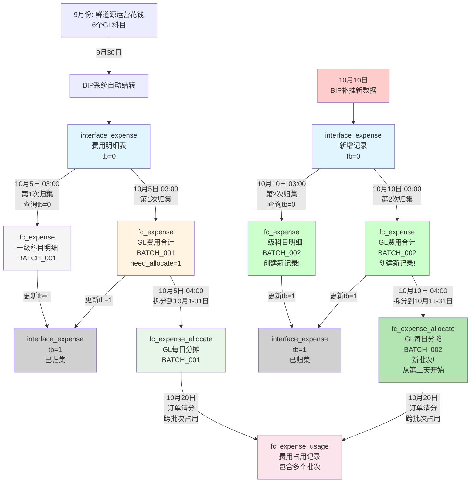

# 费用多次归集说明

## 一、业务背景

### 1.1 为什么需要多次归集？

**现实情况：**
- BIP系统会在不同时间点**多次推送**同一期间的费用数据
- 财务可能会**补录**或**修正**历史数据
- 每次推送后，collection job触发，需要创建**新的fc_expense记录**

**示例场景：**
```
9月份运营 → 10月归集费用

10月5日：BIP第一次推送9月费用数据 → 归集创建批次1
10月10日：BIP补推9月漏掉的数据 → 归集创建批次2
结果：同一主体9月期间有2条GL记录（不同批次）
```

---

## 二、核心设计

### 2.1 关键点

| 特性 | 说明 |
|------|------|
| ❌ **无唯一约束** | 允许同一主体+期间+科目有多条记录 |
| ✅ **不删除旧数据** | 每次归集创建新记录，保留历史 |
| ✅ **tb字段控制** | 只处理tb=0的记录，处理后更新为tb=1 |
| ✅ **批次号标识** | 通过import_batch和create_time区分批次 |
| ✅ **按日期范围占用** | 订单清分时指定日期范围查询费用 |

### 2.2 数据流转

```
interface_expense (tb=0)
  ↓ 查询并汇总
fc_expense (创建新记录，带批次号)
  ↓ 拆分到每天
fc_expense_allocate (按日期拆分)
  ↓ 更新状态
interface_expense (tb=1)
```

### 2.3 完整流程图



**关键变化：**
- ✅ **支持多次归集**：同一期间可以有多个批次（BATCH_001, BATCH_002...）
- ✅ **不删除旧数据**：每次归集创建新记录，不影响已有记录
- ✅ **跨批次占用**：订单清分时可以占用所有批次的可用费用
- ✅ **tb字段控制**：只处理tb=0的记录，处理后更新为tb=1，避免重复归集

---

## 三、完整示例

### 3.1 第一次归集（10月5日）

#### 步骤1：interface_expense 初始数据（tb=0）

**9月份费用数据（BIP第一次推送）：**

| ID | 主体 | 期间 | 科目 | 金额 | tb |
|----|------|------|------|------|-----|
| 1001 | 鲜道源 | 202509 | 6602 | 20,000 | 0 |
| 1002 | 鲜道源 | 202509 | 6603 | 30,000 | 0 |
| 1003 | 鲜道源 | 202509 | 6601 | 12,000 | 0 |
| 1004 | 鲜道源 | 202509 | 6403 | 5,000 | 0 |
| 1005 | 鲜道源 | 202509 | 6301 | 3,000 | 0 |
| 1006 | 鲜道源 | 202509 | 6117 | 1,500 | 0 |

**GL合计计算公式：**

```
GL合计 = (借方：三项费用 + 税金及附加) - (贷方：营业外收入 + 其他收益)
      = (6602 + 6603 + 6601 + 6403) - (6301 + 6117)
      = (20,000 + 30,000 + 12,000 + 5,000) - (3,000 + 1,500)
      = 67,000 - 4,500
      = 62,500
```

**说明：**
- **借方科目（费用）**：6602（业务宣传费）、6603（业务招待费）、6601（差旅费）、6403（税金及附加）
- **贷方科目（收入）**：6301（营业外收入）、6117（其他收益）
- GL = 借方合计 - 贷方合计

---

#### 步骤2：归集到 fc_expense（批次1）

**10月5日 03:00 - Collection Job触发：**

| ID | 主体 | 期间 | 科目 | 金额 | 需要拆分 | 批次 | 创建时间 |
|----|------|------|------|------|----------|------|----------|
| 1 | 鲜道源 | 202509 | 6602 | 20,000 | 0 | BATCH_001 | 2024-10-05 03:00 |
| 2 | 鲜道源 | 202509 | 6603 | 30,000 | 0 | BATCH_001 | 2024-10-05 03:00 |
| 3 | 鲜道源 | 202509 | 6601 | 12,000 | 0 | BATCH_001 | 2024-10-05 03:00 |
| 4 | 鲜道源 | 202509 | 6403 | 5,000 | 0 | BATCH_001 | 2024-10-05 03:00 |
| 5 | 鲜道源 | 202509 | 6301 | 3,000 | 0 | BATCH_001 | 2024-10-05 03:00 |
| 6 | 鲜道源 | 202509 | 6117 | 1,500 | 0 | BATCH_001 | 2024-10-05 03:00 |
| **7** | **鲜道源** | **202509** | **GL** | **62,500** | **1** | **BATCH_001** | **2024-10-05 03:00** |

---

#### 步骤3：拆分到 fc_expense_allocate（10月1-31日）

**拆分逻辑：**
```
每天金额 = 62,500 / 31 = 2,016.13 (前30天)
最后一天 = 62,500 - (2,016.13 × 30) = 2,016.10
```

| ID | fc_expense_id | 主体 | 日期 | 金额 | 可用金额 | 已用金额 |
|----|---------------|------|------|------|----------|----------|
| 1 | 7 | 鲜道源 | 2024-10-01 | 2,016.13 | 2,016.13 | 0 |
| 2 | 7 | 鲜道源 | 2024-10-02 | 2,016.13 | 2,016.13 | 0 |
| ... | ... | ... | ... | ... | ... | ... |
| 31 | 7 | 鲜道源 | 2024-10-31 | 2,016.10 | 2,016.10 | 0 |

---

#### 步骤4：更新 interface_expense.tb=1

| ID | 主体 | 期间 | 科目 | 金额 | tb |
|----|------|------|------|------|-----|
| 1001 | 鲜道源 | 202509 | 6602 | 20,000 | **1** ✅ |
| 1002 | 鲜道源 | 202509 | 6603 | 30,000 | **1** ✅ |
| ... | ... | ... | ... | ... | **1** ✅ |

---

### 3.2 第二次归集（10月10日）

#### 步骤1：新增 interface_expense 数据（tb=0）

**场景：BIP系统补推9月份漏掉的数据**

| ID | 主体 | 期间 | 科目 | 金额 | tb |
|----|------|------|------|------|-----|
| 1007 | 鲜道源 | 202509 | 6602 | 5,000 | 0 |
| 1008 | 鲜道源 | 202509 | 6603 | 3,000 | 0 |

**新增GL合计 = 5,000 + 3,000 = 8,000**

---

#### 步骤2：归集到 fc_expense（批次2，创建新记录！）

**10月10日 03:00 - Collection Job再次触发：**

| ID | 主体 | 期间 | 科目 | 金额 | 需要拆分 | 批次 | 创建时间 |
|----|------|------|------|------|----------|------|----------|
| 8 | 鲜道源 | 202509 | 6602 | 5,000 | 0 | BATCH_002 | 2024-10-10 03:00 |
| 9 | 鲜道源 | 202509 | 6603 | 3,000 | 0 | BATCH_002 | 2024-10-10 03:00 |
| **10** | **鲜道源** | **202509** | **GL** | **8,000** | **1** | **BATCH_002** | **2024-10-10 03:00** |

**重要：**
- ❌ **没有删除** ID 1-7 的记录
- ✅ **创建了新记录** ID 8-10
- ✅ **同一主体+期间现在有2条GL记录**（ID 7 和 ID 10）

---

#### 步骤3：拆分到 fc_expense_allocate（10月11-31日）

**拆分逻辑（从归集日期的第二天开始）：**
```
归集日期：10月10日
拆分范围：10月11日 - 10月31日（21天）
每天金额 = 8,000 / 21 = 380.95
```

| ID | fc_expense_id | 主体 | 日期 | 金额 | 可用金额 | 已用金额 |
|----|---------------|------|------|------|----------|----------|
| 32 | 10 | 鲜道源 | 2024-10-11 | 380.95 | 380.95 | 0 |
| 33 | 10 | 鲜道源 | 2024-10-12 | 380.95 | 380.95 | 0 |
| ... | ... | ... | ... | ... | ... | ... |
| 52 | 10 | 鲜道源 | 2024-10-31 | 380.95 | 380.95 | 0 |

**现在 fc_expense_allocate 表中的情况：**

| 日期 | 批次1 | 批次2 | 当天可用总额 |
|------|-------|-------|-------------|
| 10-01 | 2,016.13 | - | 2,016.13 |
| 10-02 | 2,016.13 | - | 2,016.13 |
| ... | ... | - | ... |
| 10-10 | 2,016.13 | - | 2,016.13 |
| 10-11 | 2,016.13 | 380.95 | **2,397.08** ✅ |
| 10-12 | 2,016.13 | 380.95 | **2,397.08** ✅ |
| ... | ... | ... | ... |
| 10-31 | 2,016.10 | 380.95 | **2,397.05** ✅ |

**关键点：**
- ✅ 批次2从10月11日开始（归集日期的第二天）
- ✅ 10月1-10日只有批次1的费用
- ✅ 10月11-31日有批次1+批次2的费用

---

### 3.3 订单清分（按日期从小到大占用）

#### 场景：10月20日清分

**清分需求：**
- 任务ID：100
- 主体：鲜道源
- 需要占用GL费用：25,000（需要跨批次占用）

---

#### 查询可用费用（按日期从小到大排序）

```sql
SELECT id, fc_expense_id, date, amount, available_amount
FROM fc_expense_allocate
WHERE org_id = '鲜道源'
  AND exp_type_code = 'GL'
  AND available_amount > 0
ORDER BY date ASC;  -- 按日期从小到大排序
```

**查询结果（从10月1日开始）：**

| ID | 日期 | 批次 | 可用金额 |
|----|------|------|----------|
| 1 | 10-01 | BATCH_001 | 2,016.13 |
| 2 | 10-02 | BATCH_001 | 2,016.13 |
| 3 | 10-03 | BATCH_001 | 2,016.13 |
| ... | ... | ... | ... |
| 10 | 10-10 | BATCH_001 | 2,016.13 |
| 11 | 10-11 | BATCH_001 | 2,016.13 |
| 32 | 10-11 | BATCH_002 | 380.95 |
| 12 | 10-12 | BATCH_001 | 2,016.13 |
| 33 | 10-12 | BATCH_002 | 380.95 |
| ... | ... | ... | ... |

---

#### 占用计算（按日期从小到大，跨批次占用）

| 顺序 | ID | 日期 | 批次 | 可用金额 | 本次占用 | 剩余需占用 |
|------|-----|------|------|----------|----------|------------|
| 1 | 1 | 10-01 | BATCH_001 | 2,016.13 | 2,016.13 | 22,983.87 |
| 2 | 2 | 10-02 | BATCH_001 | 2,016.13 | 2,016.13 | 20,967.74 |
| 3 | 3 | 10-03 | BATCH_001 | 2,016.13 | 2,016.13 | 18,951.61 |
| 4 | 4 | 10-04 | BATCH_001 | 2,016.13 | 2,016.13 | 16,935.48 |
| 5 | 5 | 10-05 | BATCH_001 | 2,016.13 | 2,016.13 | 14,919.35 |
| 6 | 6 | 10-06 | BATCH_001 | 2,016.13 | 2,016.13 | 12,903.22 |
| 7 | 7 | 10-07 | BATCH_001 | 2,016.13 | 2,016.13 | 10,887.09 |
| 8 | 8 | 10-08 | BATCH_001 | 2,016.13 | 2,016.13 | 8,870.96 |
| 9 | 9 | 10-09 | BATCH_001 | 2,016.13 | 2,016.13 | 6,854.83 |
| 10 | 10 | 10-10 | BATCH_001 | 2,016.13 | 2,016.13 | 4,838.70 |
| 11 | 11 | 10-11 | BATCH_001 | 2,016.13 | 2,016.13 | 2,822.57 |
| 12 | 32 | 10-11 | BATCH_002 | 380.95 | 380.95 | 2,441.62 |
| 13 | 12 | 10-12 | BATCH_001 | 2,016.13 | 2,016.13 | 425.49 |
| 14 | 33 | 10-12 | BATCH_002 | 380.95 | 380.95 | 44.54 |
| 15 | 13 | 10-13 | BATCH_001 | 2,016.13 | 44.54 | **0** ✅ |

**验证：**
- 批次1占用：2,016.13 × 11 + 2,016.13 + 44.54 = 22,177.43 + 2,060.67 = 24,238.10
- 批次2占用：380.95 × 2 = 761.90
- 总计：24,238.10 + 761.90 = 25,000.00 ✅

**说明：**
- ✅ **按日期从小到大排序**，优先占用早期日期
- ✅ **从10月1日开始占用**，占用到10月13日满足需求
- ✅ **跨批次占用**：同时占用了批次1和批次2的费用
- ✅ **10月11日和10月12日同时占用了两个批次**（先占用BATCH_001，再占用BATCH_002）
- ✅ 系统自动按日期顺序处理，无需手动区分批次

---

**Just code it !!**

