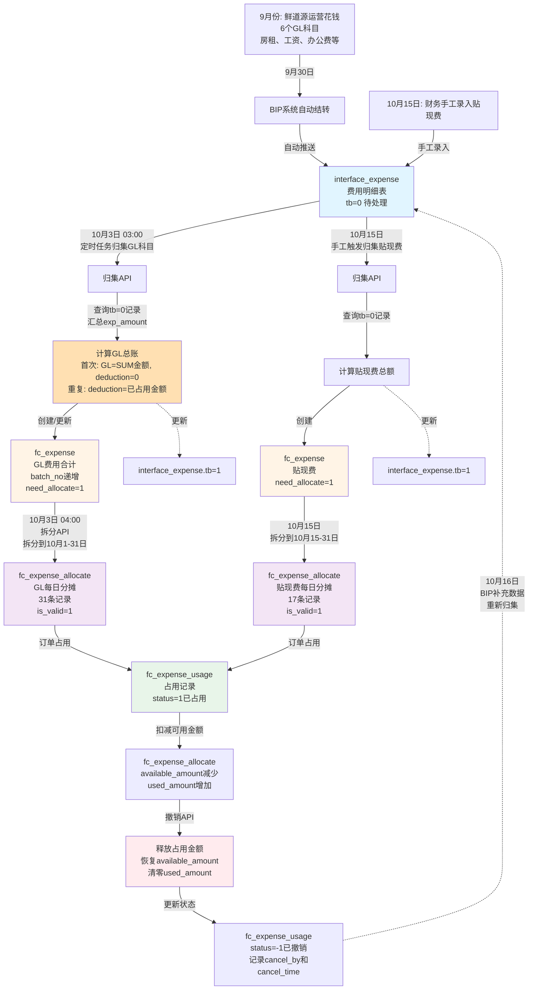
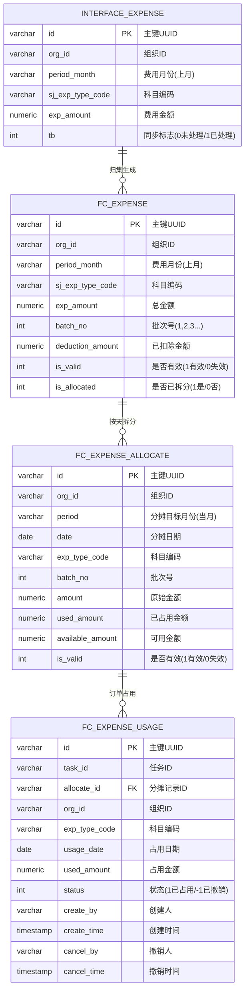
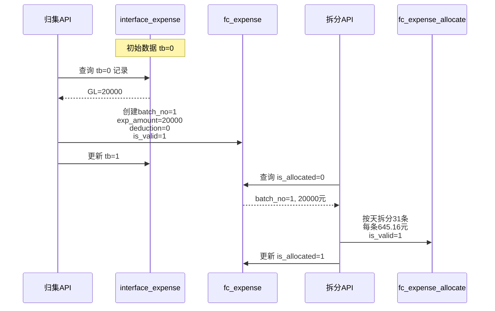
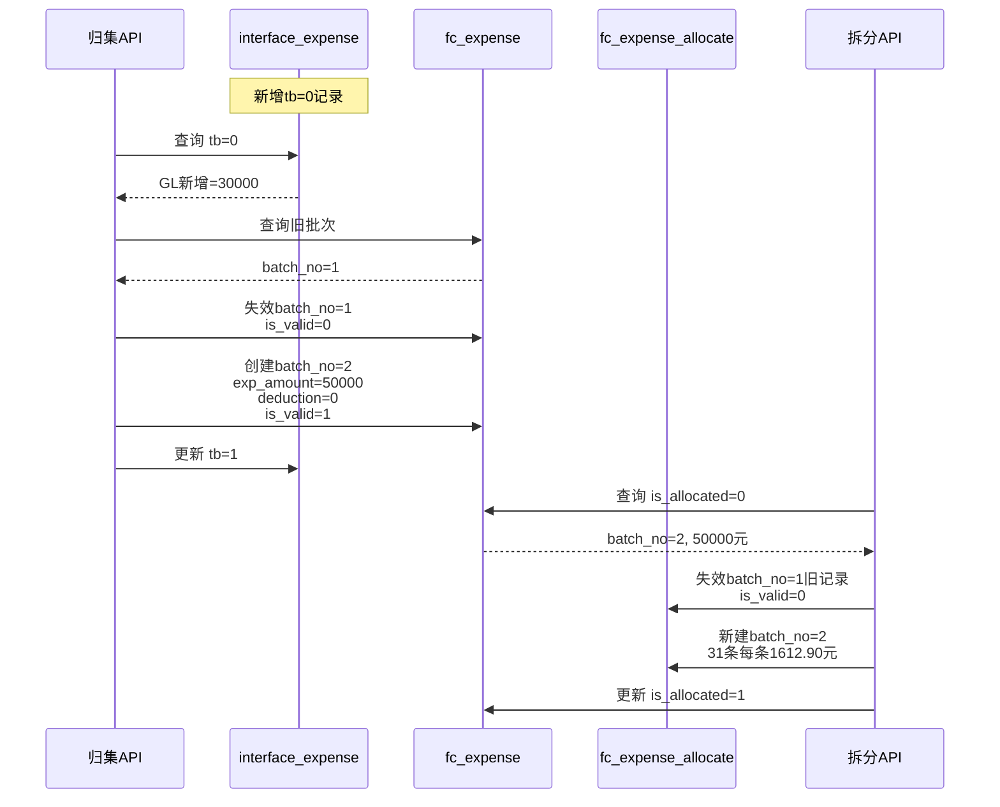
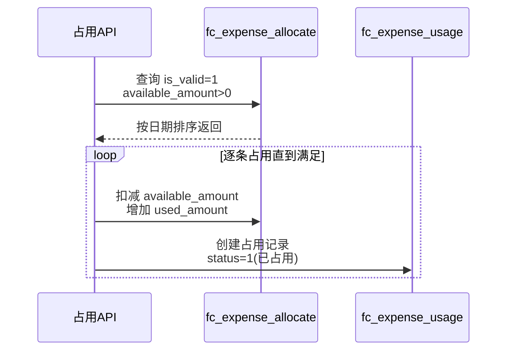
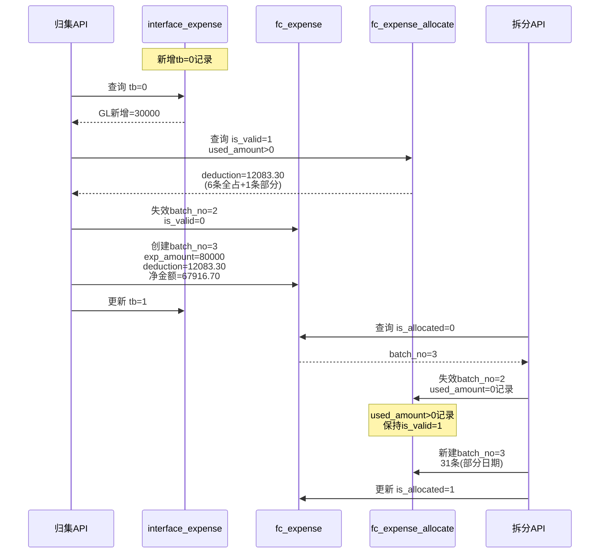
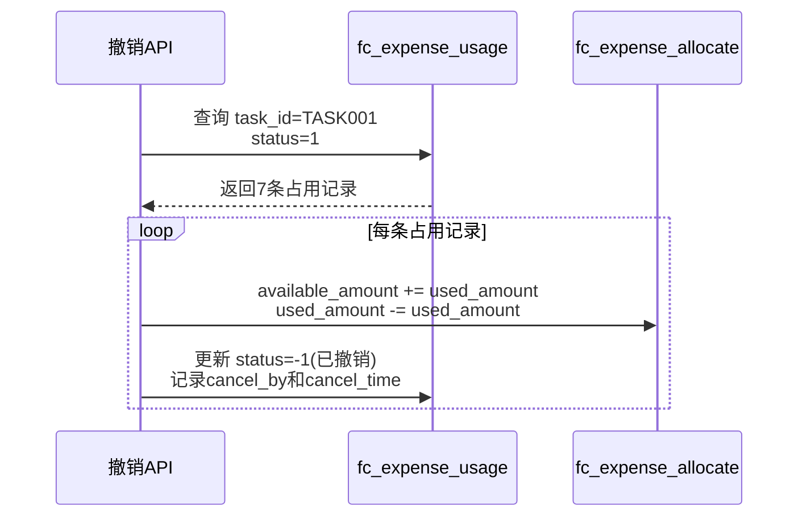

# 清分系统 - 费用归集占用流程文档

## 一、业务概述

### 1.1 什么是清分？

**一句话**：自动算账，把中间商的成本加到价格里

```
兽之泰（老板）：不想自己干活
├─ 采购：找鲜道源、产服、合作社帮忙买猪
└─ 销售：找猪小呆、兽之鲜帮忙卖猪肉

清分系统：自动计算每个小弟该赚多少钱
```

### 1.2 什么是费用分摊？

**把上个月的运营成本，分摊到这个月的订单上**

```
鲜道源9月运营成本：62,000元
├─ 房租：20,000
├─ 工资：30,000
├─ 办公费：5,000
└─ 车辆维护：7,000

10月分摊：62,000 / 31天 = 2,000元/天

10月每笔订单：从费用池拿钱加价
```

---

## 二、核心数据流转

### 2.1 完整业务流程图（支持多次归集）



### 2.2 关键计算公式

#### 公式1：GL总账金额（首次归集）
```sql
-- 场景：首次归集 batch_no=1
GL总账 = SELECT SUM(exp_amount) 
         FROM interface_expense 
         WHERE org_id = ? 
           AND period_month = ?
           AND sj_exp_type_code IN ('6602', '6603', ...)  -- 管理费用等科目
           AND tb = 0;

deduction_amount = 0;
净金额 = GL总账;
```

#### 公式2：已扣除金额（重复归集时）
```sql
-- 场景：第N次归集（N>1）
deduction_amount = SELECT SUM(amount)  -- amount = used_amount + available_amount
                   FROM fc_expense_allocate
                   WHERE org_id = ?
                     AND period = ?  -- 注意：这是目标月份（当月）
                     AND exp_type_code = 'GL'
                     AND is_valid = 1
                     AND used_amount > 0;  -- 只计算有占用的记录

-- 解释：
-- 1. 只统计 is_valid=1（有效记录，可能来自不同批次）
-- 2. 只统计 used_amount>0（有实际占用的记录）
-- 3. 统计完整的 amount（包含已占用+剩余可用）
-- 4. 这样可以避免重复分配已被占用的费用
```

#### 公式3：净金额（重复归集时）
```sql
-- 第N次归集
GL总账新 = SELECT SUM(exp_amount) 
           FROM interface_expense 
           WHERE ... AND tb = 0;

净金额 = GL总账新 - deduction_amount;

-- 示例：
-- batch_no=1: GL=20000,  deduction=0,      净金额=20000
-- batch_no=2: GL=50000,  deduction=0,      净金额=50000（无占用）
-- batch_no=3: GL=80000,  deduction=12083,  净金额=67917（有占用10000后）
```

#### 公式4：按天拆分金额
```sql
-- 拆分到 fc_expense_allocate
每天金额 = 净金额 / 当月天数;

-- 示例：
-- 202511月31天，净金额=20000
-- 每天金额 = 20000 / 31 = 645.16元
```

#### 公式5：费用占用
```sql
-- 订单占用时
UPDATE fc_expense_allocate
SET used_amount = used_amount + 占用金额,
    available_amount = available_amount - 占用金额
WHERE id = ?;

-- 金额守恒：amount = used_amount + available_amount（始终成立）
```

#### 公式6：费用撤销
```sql
-- 订单撤销时
UPDATE fc_expense_allocate
SET used_amount = used_amount - 撤销金额,
    available_amount = available_amount + 撤销金额
WHERE id = ?;

-- 恢复可用，is_valid保持=1
```

### 2.3 多次归集示例流程

| 时间点 | 操作 | GL总账 | deduction | 净金额 | 说明 |
|--------|------|--------|-----------|--------|------|
| T1 | 首次归集 | 20000 | 0 | 20000 | batch_no=1 |
| T2 | 第2次归集（无占用） | 50000 | 0 | 50000 | batch_no=2，batch1失效 |
| T3 | 订单占用 | - | - | - | 占用10000元 |
| T4 | **第3次归集（有占用）** | **80000** | **12083** | **67917** | batch_no=3，batch2失效<br/>但batch2中7条有占用记录保持有效 |
| T5 | 撤销占用 | - | - | - | 释放10000元 |
| T6 | 第4次归集 | 100000 | 0 | 100000 | batch_no=4，无占用记录 |

**关键点**：
- T4时刻，`deduction=12083` 来自 batch2 的 7条记录（6条全占+1条部分占）
- 这7条记录的完整金额（amount）被统计进 deduction，避免重复分配
- batch3 的净金额 67917 = 80000（新GL） - 12083（已占用的完整金额）

---

## 三、数据模型（ER图）



---

## 四、归集拆分流程（场景1-5）

### 场景1：首次归集和拆分

**业务场景**：202510月费用首次归集到202511月



#### 数据状态

**interface_expense（归集前）**

| 组织ID | 期间 | 科目编码 | 科目名称 | 金额 | 同步标志 |
|--------|------|----------|----------|------|----------|
| ORG001 | 202510 | 6602 | 管理费用 | 20000.00 | 0 |

**interface_expense（归集后）**

| 组织ID | 期间 | 科目编码 | 科目名称 | 金额 | 同步标志 |
|--------|------|----------|----------|------|----------|
| ORG001 | 202510 | 6602 | 管理费用 | 20000.00 | **1** |

**fc_expense**

| 组织ID | 期间 | 科目编码 | 批次号 | 总金额 | 已扣除金额 | 净金额 | 是否有效 | 是否已拆分 |
|--------|------|----------|--------|--------|------------|--------|----------|------------|
| ORG001 | 202510 | GL | 1 | 20000.00 | 0.00 | 20000.00 | 1 | 1 |

**公式**：`净金额 = 总金额(20000) - 已扣除金额(0) = 20000`

**fc_expense_allocate（部分展示）**

| 组织ID | 期间 | 日期 | 科目编码 | 批次号 | 原始金额 | 已占用金额 | 可用金额 | 是否有效 |
|--------|------|------|----------|--------|----------|------------|----------|----------|
| ORG001 | 202511 | 2025-11-01 | GL | 1 | 645.16 | 0.00 | 645.16 | 1 |
| ORG001 | 202511 | 2025-11-02 | GL | 1 | 645.16 | 0.00 | 645.16 | 1 |
| ... | ... | ... | ... | ... | ... | ... | ... | ... |
| ORG001 | 202511 | 2025-11-31 | GL | 1 | 645.16 | 0.00 | 645.16 | 1 |

---

### 场景2：第二次归集（无占用）

**业务场景**：BIP新增数据，金额增加到50000，重新归集



#### 数据状态

**fc_expense（归集后）**

| 组织ID | 期间 | 科目编码 | 批次号 | 总金额 | 已扣除金额 | 净金额 | 是否有效 | 是否已拆分 |
|--------|------|----------|--------|--------|------------|--------|----------|------------|
| ORG001 | 202510 | GL | 1 | 20000.00 | 0.00 | 20000.00 | **0** | 1 |
| ORG001 | 202510 | GL | 2 | 50000.00 | 0.00 | 50000.00 | **1** | 1 |

**fc_expense_allocate（拆分后）**

| 组织ID | 期间 | 日期 | 批次号 | 原始金额 | 已占用金额 | 可用金额 | 是否有效 |
|--------|------|------|--------|----------|------------|----------|----------|
| ORG001 | 202511 | 2025-11-01 | 1 | 645.16 | 0.00 | 645.16 | **0** |
| ORG001 | 202511 | 2025-11-01 | 2 | 1612.90 | 0.00 | 1612.90 | **1** |
| ... | ... | ... | ... | ... | ... | ... | ... |

---

### 场景3：订单占用费用

**业务场景**：任务TASK001占用10000元费用



#### 数据状态

**fc_expense_allocate（占用前 vs 占用后）**

| 日期 | 批次号 | 原始金额 | 已占用金额 | 可用金额 | 是否有效 | 变化说明 |
|------|--------|----------|------------|----------|----------|----------|
| 2025-11-01 | 2 | 1612.90 | 0.00→**1612.90** | 1612.90→**0.00** | 1 | 全部占用 |
| 2025-11-02 | 2 | 1612.90 | 0.00→**1612.90** | 1612.90→**0.00** | 1 | 全部占用 |
| 2025-11-03 | 2 | 1612.90 | 0.00→**1612.90** | 1612.90→**0.00** | 1 | 全部占用 |
| 2025-11-04 | 2 | 1612.90 | 0.00→**1612.90** | 1612.90→**0.00** | 1 | 全部占用 |
| 2025-11-05 | 2 | 1612.90 | 0.00→**1612.90** | 1612.90→**0.00** | 1 | 全部占用 |
| 2025-11-06 | 2 | 1612.90 | 0.00→**1612.90** | 1612.90→**0.00** | 1 | 全部占用 |
| 2025-11-07 | 2 | 1612.90 | 0.00→**333.36** | 1612.90→**1279.54** | 1 | **部分占用** |

**fc_expense_usage**

| 任务ID | 分摊记录ID | 组织ID | 科目编码 | 占用日期 | 占用金额 | 状态 |
|--------|------------|--------|----------|----------|----------|------|
| TASK001 | allocate-id-1 | ORG001 | GL | 2025-11-01 | 1612.90 | 1 |
| TASK001 | allocate-id-2 | ORG001 | GL | 2025-11-02 | 1612.90 | 1 |
| ... | ... | ... | ... | ... | ... | ... |
| TASK001 | allocate-id-7 | ORG001 | GL | 2025-11-07 | 333.36 | 1 |

**金额验证**：1612.90×6 + 333.36 = 10000.76（误差0.76元为除法精度）

---

### 场景4：有占用后再归集

**业务场景**：已占用10000后，BIP新增数据到80000，重新归集



#### 数据状态

**fc_expense**

| 组织ID | 期间 | 科目编码 | 批次号 | 总金额 | 已扣除金额 | 净金额 | 是否有效 | 是否已拆分 |
|--------|------|----------|--------|--------|------------|--------|----------|------------|
| ORG001 | 202510 | GL | 1 | 20000.00 | 0.00 | 20000.00 | 0 | 1 |
| ORG001 | 202510 | GL | 2 | 50000.00 | 0.00 | 50000.00 | **0** | 1 |
| ORG001 | 202510 | GL | 3 | 80000.00 | **12083.30** | **67916.70** | **1** | 1 |

**公式**：
```
已扣除金额(deduction_amount) = SUM(fc_expense_allocate.amount 
                                WHERE is_valid=1 AND used_amount>0)
                              = 1612.90×6 + 1612.90 = 12083.30

净金额 = 80000 - 12083.30 = 67916.70
```

**fc_expense_allocate（关键记录）**

| 日期 | 批次号 | 原始金额 | 已占用金额 | 可用金额 | 是否有效 | 说明 |
|------|--------|----------|------------|----------|----------|------|
| 2025-11-01 | 2 | 1612.90 | 1612.90 | 0.00 | **1** | 有占用，保持有效 |
| 2025-11-02 | 2 | 1612.90 | 1612.90 | 0.00 | **1** | 有占用，保持有效 |
| ... | 2 | ... | ... | ... | **1** | ... |
| 2025-11-07 | 2 | 1612.90 | 333.36 | 1279.54 | **1** | **部分占用，保持有效** |
| 2025-11-08 | 2 | 1612.90 | 0.00 | 1612.90 | **0** | 无占用，失效 |
| ... | 2 | ... | ... | ... | **0** | ... |
| 2025-11-08 | 3 | 2190.86 | 0.00 | 2190.86 | **1** | 新批次记录 |
| ... | 3 | ... | ... | ... | **1** | ... |

**金额验证**：
- 有效可用金额 = 1279.54(batch2部分) + 2190.86×24(batch3) = 80000.00 ✅

---

### 场景5：撤销占用

**业务场景**：TASK001撤销，释放已占用的10000元



#### 数据状态

**fc_expense_allocate（撤销后）**

| 日期 | 批次号 | 原始金额 | 已占用金额 | 可用金额 | 是否有效 |
|------|--------|----------|------------|----------|----------|
| 2025-11-01 | 2 | 1612.90 | 1612.90→**0.00** | 0.00→**1612.90** | 1 |
| 2025-11-02 | 2 | 1612.90 | 1612.90→**0.00** | 0.00→**1612.90** | 1 |
| ... | 2 | ... | ... | ... | 1 |
| 2025-11-07 | 2 | 1612.90 | 333.36→**0.00** | 1279.54→**1612.90** | 1 |
| 2025-11-08 | 3 | 2190.86 | 0.00 | 2190.86 | 1 |

**fc_expense_usage（撤销后）**

| 任务ID | 占用日期 | 占用金额 | 状态 | 撤销人 | 撤销时间 |
|--------|----------|----------|------|--------|----------|
| TASK001 | 2025-11-01 | 1612.90 | **-1** | admin | 2025-11-12 10:30:00 |
| TASK001 | 2025-11-02 | 1612.90 | **-1** | admin | 2025-11-12 10:30:00 |
| ... | ... | ... | **-1** | admin | ... |

**金额验证**：
- 总可用金额 = 1612.90×7 + 2190.86×24 = 80000.00 ✅
- 已占用金额 = 0 ✅

---

## 五、核心业务规则

### 5.1 批次管理规则

| 规则 | 说明 |
|------|------|
| **批次递增** | 同一org_id+period_month，每次归集batch_no+1 |
| **唯一有效** | 同一单元只有最新batch_no的记录is_valid=1 |
| **失效时机** | 新批次创建时，旧批次自动失效 |

### 5.2 失效保护规则

| 场景 | fc_expense | fc_expense_allocate |
|------|------------|---------------------|
| **无占用** | 旧批次is_valid=0 | 旧批次全部is_valid=0 |
| **有占用** | 旧批次is_valid=0 | used_amount>0记录保持is_valid=1<br/>used_amount=0记录is_valid=0 |

### 5.3 金额计算规则

**deduction_amount（已扣除金额）**
```sql
SELECT SUM(amount)  -- amount = used_amount + available_amount
FROM fc_expense_allocate
WHERE org_id = ? 
  AND period = ?
  AND exp_type_code = 'GL'
  AND is_valid = 1
  AND used_amount > 0
```

**净金额**
```
净金额 = 本次GL总额 - deduction_amount
```

### 5.4 占用规则

| 规则 | 说明 |
|------|------|
| **查询条件** | is_valid=1 AND available_amount>0 |
| **占用顺序** | 按date升序，优先占用早期日期 |
| **跨批次** | 可占用不同batch_no的有效记录 |
| **部分占用** | 单条记录可部分占用，剩余进available_amount |

### 5.5 撤销规则

| 规则 | 说明 |
|------|------|
| **恢复金额** | available_amount += 撤销金额 |
| **清零占用** | used_amount -= 撤销金额 |
| **保持有效** | 无论哪个批次，撤销后仍is_valid=1 |
| **状态更新** | fc_expense_usage.status = -1 |

---

## 六、金额守恒验证

### 验证SQL

```sql
-- 验证1：单批次金额守恒
SELECT 
  batch_no,
  SUM(amount) as total,
  SUM(used_amount) as used,
  SUM(available_amount) as available,
  CASE 
    WHEN SUM(amount) = SUM(used_amount) + SUM(available_amount) 
    THEN '✅ 守恒' 
    ELSE '❌ 异常' 
  END as check_result
FROM fc_expense_allocate
WHERE org_id = 'ORG001' AND period = '202511' AND is_valid = 1
GROUP BY batch_no;

-- 验证2：占用记录一致性
SELECT 
  fea.id,
  fea.used_amount as allocate_used,
  COALESCE(SUM(feu.used_amount), 0) as usage_sum,
  CASE 
    WHEN fea.used_amount = COALESCE(SUM(feu.used_amount), 0) 
    THEN '✅ 一致' 
    ELSE '❌ 不一致' 
  END as check_result
FROM fc_expense_allocate fea
LEFT JOIN fc_expense_usage feu 
  ON fea.id = feu.allocate_id AND feu.status = 1
WHERE fea.org_id = 'ORG001' AND fea.period = '202511' AND fea.is_valid = 1
GROUP BY fea.id, fea.used_amount;

-- 验证3：总可用金额
SELECT 
  SUM(available_amount) as total_available,
  CASE 
    WHEN SUM(available_amount) >= 0 
    THEN '✅ 正常' 
    ELSE '❌ 负数异常' 
  END as check_result
FROM fc_expense_allocate
WHERE org_id = 'ORG001' AND period = '202511' AND is_valid = 1;
```
